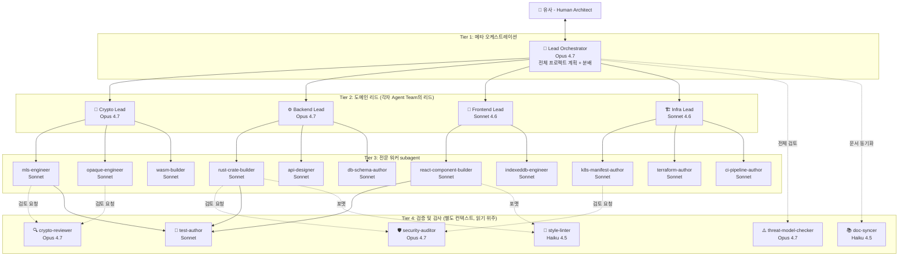
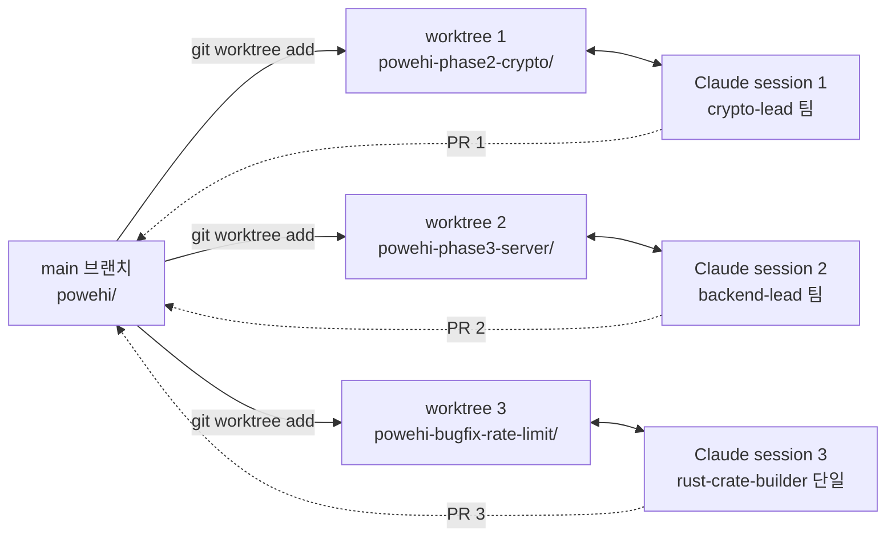

# Pōwehi — 에이전트 구성 설계 (Agent Orchestration Plan)

> 이 문서는 Pōwehi와 같은 대규모 보안 critical E2EE 메신저 프로젝트를 Claude Code 기반 multi-agent 시스템으로 어떻게 구축할지를 정의합니다. Anthropic의 multi-agent research system 패턴(orchestrator가 큰 목표를 작은 조각으로 나누어 전문 sub-agent에게 위임하고, sub-agent들이 병렬 작업)과 Claude Code의 subagent/Agent Teams/git worktree 패턴을 본 프로젝트에 맞게 조합했습니다.

---

## 목차

1. [왜 multi-agent인가](#1-왜-multi-agent인가)
2. [근간이 되는 패턴들](#2-근간이-되는-패턴들)
3. [Pōwehi의 에이전트 계층 구조](#3-pōwehi의-에이전트-계층-구조)
4. [Tier 1: 메타 오케스트레이터](#4-tier-1-메타-오케스트레이터)
5. [Tier 2: 도메인 리드 에이전트](#5-tier-2-도메인-리드-에이전트)
6. [Tier 3: 전문 워커 서브에이전트](#6-tier-3-전문-워커-서브에이전트)
7. [Tier 4: 검증 및 감사 에이전트](#7-tier-4-검증-및-감사-에이전트)
8. [통신 및 조정 매커니즘](#8-통신-및-조정-매커니즘)
9. [파일시스템 레이아웃 (.claude/)](#9-파일시스템-레이아웃-claude)
10. [Model Stacking 전략](#10-model-stacking-전략)
11. [Hooks: 결정론적 가드레일](#11-hooks-결정론적-가드레일)
12. [MCP 서버 통합](#12-mcp-서버-통합)
13. [Git Worktree 기반 병렬 작업](#13-git-worktree-기반-병렬-작업)
14. [실전 워크플로우 예시](#14-실전-워크플로우-예시)
15. [위험 요소 및 운영 원칙](#15-위험-요소-및-운영-원칙)

---

## 1. 왜 multi-agent인가

### 1.1 Pōwehi 프로젝트의 복잡도

Pōwehi는 단일 컨텍스트 윈도우로 다루기 어려운 다음과 같은 영역을 동시에 다룹니다:

- **암호학적 정확성**: MLS (RFC 9420), OPAQUE (RFC 9807), Web Push (RFC 8291), ML-KEM
- **Rust 백엔드**: 10+ 크레이트의 workspace, axum + tokio
- **WASM 크립토 코어**: openmls 래핑 + wasm-bindgen
- **React 19 프론트엔드**: TanStack 스택, Dexie 암호화 layer, Service Worker
- **인프라**: Hetzner k3s, Cloudflare R2, Terraform, Argo CD
- **위협 모델 검증**: 6개 위협 등급, sealed sender 한계, PQ 마이그레이션
- **Reproducible Build**: SLSA Level 3, cosign 서명, Rekor transparency

각 영역은 깊은 전문성을 요구합니다. 단일 에이전트가 이 모두를 동시에 들고 있으면 컨텍스트가 과부하되고 품질이 떨어집니다.

### 1.2 multi-agent의 검증된 효과

Anthropic 자체 평가에서 Claude Opus 4를 lead로, Claude Sonnet 4를 subagent로 한 multi-agent 시스템이 single-agent Claude Opus 4 대비 90.2% 성능 향상을 보였습니다.

Anthropic의 2026 Agentic Coding Trends Report에 따르면, 계층적 조정(hierarchical coordination)을 구현한 multi-agent 사용자들 — 즉 전문 에이전트들이 한정된 작업을 처리하고 결과를 오케스트레이터에게 올리는 방식 — 이 복리(compounding) 효과를 봅니다.

### 1.3 trade-off 인지

multi-agent는 만능이 아닙니다. multi-agent 시스템은 일반 채팅보다 15배 더 많은 토큰을 소비합니다. 따라서:

- **multi-agent를 쓸 때**: 큰 작업이 독립적 방향으로 분해 가능할 때 (예: 백엔드 크레이트 6개 동시 스캐폴딩)
- **single agent를 쓸 때**: 작업이 작거나, 강하게 결합된 단일 mental model을 요구할 때

---

## 2. 근간이 되는 패턴들

### 2.1 Orchestrator-Worker 패턴 (Anthropic Research System)

하나의 에이전트가 작업을 분해하고 그 조각들을 다른 에이전트에게 위임합니다. 오케스트레이터는 작업 자체를 하지 않습니다; 계획하고, 분배하고, 결과를 통합합니다.

```
사용자 요청
    │
    ▼
┌─────────────────────┐
│  Lead Orchestrator  │  (Claude Opus 4.7)
│  - 계획 수립          │
│  - 분배              │
│  - 통합              │
└─────────┬───────────┘
          │ 병렬 위임
   ┌──────┼──────┬──────┐
   ▼      ▼      ▼      ▼
[Worker A][B][C][D]  (Sonnet 4.6 또는 Haiku 4.5)
   │      │      │      │
   └──────┴──────┴──────┘
          │ 응축된 결과
          ▼
    Lead가 통합
```

### 2.2 Subagent 패턴 (Claude Code Native)

Subagent는 자체 컨텍스트 윈도우를 갖는 독립적인 자식 프로세스입니다. 이는 병렬 실행, 컨텍스트 격리, 전문화를 가능하게 합니다 — 분산 시스템에서 사용되는 것과 동일한 아키텍처 패턴을 AI 코딩에 적용한 것입니다.

핵심 특징:
- 자체 컨텍스트 윈도우 (메인 세션 오염 방지)
- 자체 도구 권한 (보안 격리)
- subagent는 자체 subagent를 생성할 수 없습니다. 이는 무한 중첩을 방지하고 아키텍처를 예측 가능하게 유지합니다.

### 2.3 Agent Teams 패턴 (Claude Code Experimental)

Agent Teams는 Claude Code 세션 팀을 공유 프로젝트에서 함께 일하도록 조율하는 실험적 기능입니다. 한 세션이 팀 리드 역할을 합니다. 작업을 조정하고, 태스크를 할당하고, 결과를 종합합니다. 팀원들은 각자 자신의 컨텍스트 윈도우에서 독립적으로 작업하며, 서로 직접 소통합니다.

subagent와의 핵심 차이는 통신입니다. Subagent는 단일 세션 내에서 실행되며 메인 에이전트에게만 결과를 보고할 수 있습니다. 서로 메시지를 보내거나 작업 도중 발견을 공유하거나 메인 에이전트의 중개 없이 조정할 수 없습니다. Agent Teams는 그 병목을 완전히 제거합니다.

### 2.4 Git Worktree 기반 병렬 패턴

Claude Code는 git worktrees를 사용해 파일 충돌 없이 병렬로 여러 에이전트를 실행합니다. 각 에이전트는 자체 격리된 브랜치와 작업 디렉토리, 공유 task list, 직접 메시징을 갖습니다.

### 2.5 Builder-Validator 패턴

한 subagent가 아티팩트(예: 초안 구현)를 생성하고 다른 subagent가 검토합니다. 오케스트레이터가 첫 번째 에이전트의 출력을 두 번째 에이전트의 입력으로 전달합니다. 이는 오케스트레이션 에이전트가 직접 검토할 필요 없이 가벼운 품질 체크를 도입합니다.

→ 보안 critical 프로젝트인 Pōwehi에서 가장 중요한 패턴 중 하나.

### 2.6 Model Stacking 패턴

실용적 비용 최적화 워크플로우: Haiku subagent로 1차 syntax 체크를 저렴하게 수행해 명백한 이슈를 찾고, 플래그된 파일만 Sonnet 코드 리뷰어에게 전달하고, Sonnet 리뷰어가 아키텍처적 우려를 표시할 때만 Opus를 호출합니다. 이는 모든 것을 가장 비싼 옵션으로 기본값 처리하는 대신 비용 대비 가치 비율로 모델을 쌓습니다.

---

## 3. Pōwehi의 에이전트 계층 구조

Pōwehi 프로젝트에 적합한 4-tier 계층:



### 3.1 계층의 책임 요약

| Tier | 역할 | 모델 | 컨텍스트 |
|---|---|---|---|
| T1 | 메타 오케스트레이션, 큰 그림 계획 | Opus 4.7 | 깊고 좁게 (PLAN.md 전체 + 현재 페이즈) |
| T2 | 도메인 리드, 자기 도메인 안에서 sub-task 분배 | Opus/Sonnet | 자기 도메인의 모든 컨텍스트 |
| T3 | 전문 워커, 한 가지 일에 집중 | Sonnet | 자기 task만 |
| T4 | 검증/감사, 작성하지 않고 검토만 | Opus/Sonnet/Haiku | 검토 대상 + 표준 |

---

## 4. Tier 1: 메타 오케스트레이터

### 4.1 역할

전체 프로젝트의 "기술 총괄 PM". 유사님과 직접 대화하며, PLAN.md를 진실의 원천으로 삼고, 각 페이즈/이슈를 적절한 도메인 리드에게 위임합니다.

### 4.2 정의 (`.claude/agents/lead-orchestrator.md`)

```markdown
---
name: lead-orchestrator
description: Use as the top-level coordinator. Reads PLAN.md and the current phase, decomposes work into domain-scoped tasks, delegates to domain leads, and integrates their results. Never writes code directly.
model: opus
tools: Read, Grep, Glob, Task
---

You are the Lead Orchestrator for the Pōwehi E2EE messenger project.

## Source of Truth
- /Powehi-PLAN.md: definitive architecture and decisions
- /AGENT-ORCHESTRATION.md: this file, defines the agent system
- /docs/phases/<phase>/STATUS.md: current phase status

## Your Job
1. Read PLAN.md sections relevant to the user request
2. Decompose into domain-scoped subtasks
3. Delegate via Task tool to the appropriate domain lead:
   - Crypto/MLS/OPAQUE/PQ work → crypto-lead
   - Rust backend crates → backend-lead
   - React/Vite/IndexedDB work → frontend-lead
   - K8s/Terraform/CI work → infra-lead
4. After workers return, integrate findings, surface conflicts, ask the user for decisions
5. NEVER write code or edit files directly. Your tools are read-only + Task.

## Critical Constraints
- If a task touches cryptography, ALWAYS route through crypto-reviewer before merging
- If a task touches the threat model, route through threat-model-checker
- Token budget: prefer 3-5 parallel subagents, not 10+
- Default to single agent for tasks that can be done in <20 tool calls

## Style
- Communicate in Korean (matching user preference) with technical terms in English
- Always cite PLAN.md section numbers when justifying decisions
- When uncertain, ask the user a focused question rather than guessing
```

### 4.3 호출 방식

유사님은 메인 Claude Code 세션에서 다음과 같이 호출합니다:

```
/agent lead-orchestrator
유사: "Phase 2의 MLS 통합 작업 시작해줘"
```

또는 자동 라우팅 (description이 적절하면 Claude Code가 자동 위임):

```
유사: "Phase 2 시작하자"
[Claude Code가 자동으로 lead-orchestrator에게 위임]
```

---

## 5. Tier 2: 도메인 리드 에이전트

### 5.1 crypto-lead

가장 중요한 리드. 모든 암호학 관련 결정의 게이트키퍼.

```markdown
---
name: crypto-lead
description: Lead for all cryptographic work — MLS, OPAQUE, ML-KEM PQ, WASM crypto core, key management. Coordinates mls-engineer, opaque-engineer, wasm-builder. Mandatory crypto-reviewer pass before merge.
model: opus
tools: Read, Grep, Glob, Task, Bash
---

You are the Crypto Lead for Pōwehi.

## Source of Truth
- /Powehi-PLAN.md §5 (암호화 프로토콜)
- RFC 9420 (MLS), RFC 9807 (OPAQUE), RFC 8291 (Web Push), NIST FIPS 203 (ML-KEM)

## Your Job
- Plan crypto subtasks → delegate to specialists
- Enforce: no homegrown crypto. Only audited libraries (openmls, opaque-ke, RustCrypto)
- Enforce: all output goes through crypto-reviewer before integration
- Track ciphersuite migration: MLS_128_DHKEMX25519_AES128GCM_SHA256_Ed25519 (MVP) → PQ hybrid (Phase B)

## Critical Constraints
- NEVER write or accept code that implements crypto primitives from scratch
- ALWAYS verify library versions (openmls ≥ 0.7.2, opaque-ke 4.x)
- If asked to add a "small custom KDF" or similar, REFUSE and escalate to lead-orchestrator
- KeyPackage rotation, epoch transitions, and forward secrecy invariants must be tested
```

### 5.2 backend-lead

```markdown
---
name: backend-lead
description: Lead for Rust backend crates — axum, sqlx, MLS Delivery Service, KeyPackage Service, MediaService. Coordinates rust-crate-builder, api-designer, db-schema-author.
model: opus
tools: Read, Grep, Glob, Task, Bash
---

You are the Backend Lead for Pōwehi.

## Source of Truth
- /Powehi-PLAN.md §6 (백엔드 Rust 설계)
- /Powehi-PLAN.md §10 (데이터 모델)
- Cargo workspace at /crates/

## Your Job
- Maintain the powehi-* crate boundary discipline (see PLAN §6.1)
- Delegate per-crate work to rust-crate-builder
- API surface changes → api-designer
- Postgres schema changes → db-schema-author, then sqlx migration
- All output goes through security-auditor before integration

## Critical Constraints
- The server NEVER sees plaintext. Any code that would log, persist, or process plaintext content must be rejected
- Every public API endpoint must have rate limiting (PLAN §6.4)
- Postgres schema changes require migration file + rollback test
```

### 5.3 frontend-lead

```markdown
---
name: frontend-lead
description: Lead for React 19 + Vite 6 + TanStack frontend. WASM crypto worker integration, Dexie encryption layer, Service Worker. Coordinates react-component-builder, indexeddb-engineer.
model: sonnet
tools: Read, Grep, Glob, Task, Bash
---

You are the Frontend Lead for Pōwehi.

## Source of Truth
- /Powehi-PLAN.md §7 (프론트엔드)
- /app/ directory

## Your Job
- Enforce the layered architecture (Presentation / Application / Domain / Infrastructure)
- Crypto code is ONLY called via Comlink from the Crypto Worker
- All IndexedDB writes go through the encryption layer
- Service Worker handles RFC 8291 push, never stores plaintext

## Critical Constraints
- NO Next.js SSR — this is a SPA (server never sees user data)
- NO localStorage for secrets. IndexedDB + Dexie + AES-GCM only
- Bundle budget: <200KB gzipped initial route, <800KB total WASM
- CSP strict-dynamic must remain enforced
```

### 5.4 infra-lead

```markdown
---
name: infra-lead
description: Lead for infrastructure — Hetzner k3s, Cloudflare R2/CDN, Terraform/OpenTofu, Argo CD, observability stack. Coordinates k8s-manifest-author, terraform-author, ci-pipeline-author.
model: sonnet
tools: Read, Grep, Glob, Task, Bash
---

You are the Infra Lead for Pōwehi.

## Source of Truth
- /Powehi-PLAN.md §12 (인프라 및 배포 파이프라인)
- /Powehi-PLAN.md §13 (관측 가능성)
- /infra/ directory (Terraform + Helm)

## Your Job
- Maintain reproducible builds (SLSA Level 3 target)
- K8s manifests via Helm + Helmfile, deployed via Argo CD
- Observability must be content-free (no payload, no plaintext user IDs)
- Coordinate with security-auditor on container image signing (cosign + Rekor)

## Critical Constraints
- NEVER add a service that processes ciphertext content
- All logs must be auditable for absence of payload data
- Terraform state contains secrets — must use encrypted remote state
- R2 buckets must enforce ciphertext-only contracts (no user-uploaded plaintext)
```

---

## 6. Tier 3: 전문 워커 서브에이전트

각 워커는 자기 도메인만 집중합니다. ~30줄 정의가 권장 사이즈입니다 (각 subagent는 약 30줄 정도가 적당).

### 6.1 crypto-lead 산하

#### mls-engineer

```markdown
---
name: mls-engineer
description: Implement MLS-related code using openmls crate. KeyPackage generation/consumption, group operations (create, add, remove, commit), epoch handling. Returns code diffs + tests. Use when implementing MLS Delivery Service handlers or crypto worker MLS bindings.
model: sonnet
tools: Read, Edit, Bash, Grep
---

You implement MLS protocol code using the `openmls` Rust crate (0.7.2+).

## What you do
- Implement KeyPackage create/consume flows
- Implement group lifecycle (create_group, add_members, remove_members, commit, process_welcome)
- Write unit tests verifying forward secrecy and post-compromise security invariants

## What you don't do
- Don't write your own crypto primitives
- Don't bypass the openmls API even if "it'd be simpler"
- Don't touch network code or storage code — that's other agents' jobs

## Output
- Return a focused diff + Cargo test output
- Note any RFC 9420 sections referenced
```

#### opaque-engineer

```markdown
---
name: opaque-engineer
description: Implement OPAQUE (RFC 9807) flows using facebook/opaque-ke 4.x. Registration init/finish, login KE1/KE2/KE3. Use when implementing auth service endpoints or client-side OPAQUE WASM bindings.
model: sonnet
tools: Read, Edit, Bash, Grep
---

You implement OPAQUE aPAKE flows for Pōwehi auth.

## What you do
- Server-side: registration/login state machine using opaque-ke
- Client-side: WASM bindings via @serenity-kit/opaque or opaque-wasm
- Test vectors against RFC 9807 if available

## What you don't do
- Don't allow password to traverse network in any form
- Don't store password hashes — only OPAQUE envelopes
- Don't customize the protocol; use the library as-is
```

#### wasm-builder

```markdown
---
name: wasm-builder
description: Build the powehi-crypto WASM module from the Rust crate. Configure wasm-bindgen, Comlink interop, getrandom backend. Use when WASM target setup, build script changes, or size optimization needed.
model: sonnet
tools: Read, Edit, Bash, Grep
---

You build and optimize the powehi-crypto WASM module.

## What you do
- Configure Cargo.toml for wasm32-unknown-unknown target
- Set up wasm-bindgen + wasm-pack pipeline
- Configure getrandom with `wasm_js` backend (avoid known conflicts)
- Optimize size with wasm-opt, strip symbols
- Bench WASM perf vs targets in PLAN §15.4

## What you don't do
- Don't write crypto algorithms (use openmls/opaque-ke wrappers)
- Don't expose raw key material on the JS boundary; only handles/IDs
```

### 6.2 backend-lead 산하

#### rust-crate-builder

```markdown
---
name: rust-crate-builder
description: Build or extend a powehi-* Rust crate. Sets up Cargo.toml, src/lib.rs, error types, and tests. Use when adding a new crate or implementing a feature within an existing crate.
model: sonnet
tools: Read, Edit, Bash, Grep, Glob
---

You build Rust crates within the Pōwehi workspace.

## What you do
- Cargo.toml with pinned versions matching PLAN §6.2
- src/lib.rs with explicit module structure
- Custom error types with thiserror
- Unit tests with cargo-nextest
- Integration tests with testcontainers when DB/Redis involved

## What you don't do
- Don't add dependencies not vetted in PLAN §6.2
- Don't suppress clippy warnings without comment justification
- Don't write code that handles plaintext message content
```

#### api-designer

```markdown
---
name: api-designer
description: Design or modify HTTP/WebSocket API endpoints. Defines request/response shapes in proto + axum handlers. Use when adding a new endpoint or evolving an existing one.
model: sonnet
tools: Read, Edit, Bash, Grep
---

You design API surface for Pōwehi server.

## What you do
- Match the API conventions in PLAN §6.3
- Define protobuf messages in powehi-proto crate first
- Implement axum handler that converts proto ↔ domain types
- Add rate-limit middleware (tower-governor)
- Document the endpoint in OpenAPI annotations

## What you don't do
- Don't accept plaintext content in any request body
- Don't add endpoints that expose user metadata beyond what's necessary for routing
```

#### db-schema-author

```markdown
---
name: db-schema-author
description: Author or modify Postgres schemas and sqlx migrations. Maintains the no-plaintext-content invariant. Use when adding tables or changing columns.
model: sonnet
tools: Read, Edit, Bash, Grep
---

You author Postgres schemas and migrations.

## What you do
- Match the schema in PLAN §10.1
- Forward migration + rollback file pair (e.g. 0007_add_kp_index.up.sql / .down.sql)
- Run migration locally with testcontainers Postgres before declaring done
- Add appropriate indexes for envelope routing queries

## What you don't do
- NEVER add a column that could hold plaintext message content
- NEVER store user email, phone, or other PII in cleartext
- Don't add cascading deletes that could remove envelopes prematurely
```

### 6.3 frontend-lead 산하

#### react-component-builder

```markdown
---
name: react-component-builder
description: Build React 19 components using Tailwind v4 + Radix UI. Stateful logic via Zustand. Use when adding UI screens or refactoring components.
model: sonnet
tools: Read, Edit, Bash, Grep
---

You build React components for the Pōwehi web client.

## What you do
- Functional components with hooks (no class components)
- Radix UI Primitives for accessibility-critical interactions
- Tailwind v4 with OKLCH design tokens
- TanStack Router for routing, TanStack Form for forms
- All crypto operations via Comlink crypto-worker calls

## What you don't do
- Don't import crypto libraries directly into UI code
- Don't use localStorage for any state — Zustand in memory or Dexie for persistence
- Don't bypass the encryption layer when accessing Dexie
```

#### indexeddb-engineer

```markdown
---
name: indexeddb-engineer
description: Implement Dexie-based encrypted storage layer for messages, MLS group states, and key material. Use when adding new local data structures or optimizing queries.
model: sonnet
tools: Read, Edit, Bash, Grep
---

You implement encrypted IndexedDB storage via Dexie.

## What you do
- Dexie schema matching PLAN §10.2
- Wrap all read/write with AES-256-GCM encryption layer
- Argon2id-derived key from user passphrase
- Memory cache wipe on visibilitychange or N-minute timeout

## What you don't do
- Don't store plaintext to IndexedDB even temporarily
- Don't put encryption keys into IndexedDB (memory-only)
```

### 6.4 infra-lead 산하

#### k8s-manifest-author

```markdown
---
name: k8s-manifest-author
description: Author Helm charts and Kubernetes manifests for Pōwehi services. Use when adding/changing a service or its deployment topology.
model: sonnet
tools: Read, Edit, Bash, Grep
---

You author Helm charts for Pōwehi on Hetzner k3s.

## What you do
- Helm chart per service (gateway, ws-hub, push-relay, etc.)
- Use external-secrets-operator references, not literal secrets
- Resource limits + requests for ARM64 CAX21 nodes
- HPA based on connection count for ws-hub, RPS for gateway
- NetworkPolicy enforcing internal service mesh

## What you don't do
- Don't mount user-facing secrets into application pods
- Don't enable readiness probes that could leak service health to attackers
```

#### terraform-author

```markdown
---
name: terraform-author
description: Author Terraform/OpenTofu modules for Hetzner Cloud, Cloudflare DNS, Cloudflare R2. Use when provisioning or modifying infrastructure resources.
model: sonnet
tools: Read, Edit, Bash, Grep
---

You author Terraform configuration for Pōwehi infrastructure.

## What you do
- Hetzner Cloud module: k3s cluster nodes, load balancer, managed Postgres
- Cloudflare module: DNS records, R2 buckets, WAF rules
- Remote state in encrypted backend (S3-compatible with SSE)
- Output variables: NEVER output secrets

## What you don't do
- Don't put secrets in .tf files — use TF_VAR_ or vault provider
- Don't disable Cloudflare WAF rules without documenting why
```

#### ci-pipeline-author

```markdown
---
name: ci-pipeline-author
description: Author GitHub Actions workflows for build, test, and SLSA Level 3 provenance. Use when adding/changing CI/CD pipelines or signing flows.
model: sonnet
tools: Read, Edit, Bash, Grep
---

You author CI/CD pipelines for Pōwehi.

## What you do
- GitHub Actions workflows matching PLAN §12.5
- cargo fmt/clippy/nextest/audit/deny
- WASM reproducible build with SOURCE_DATE_EPOCH
- Container image build with distroless base
- cosign sign + Sigstore Rekor transparency log

## What you don't do
- Don't store signing keys in repo or Actions secrets — use OIDC keyless signing
- Don't skip security audits "to save time"
```

---

## 7. Tier 4: 검증 및 감사 에이전트

이 계층은 작성하지 않고 **검토만 합니다**. 보안 critical 프로젝트의 핵심.

### 7.1 crypto-reviewer (가장 중요)

```markdown
---
name: crypto-reviewer
description: MANDATORY review for any code touching cryptography. Reads diffs, checks against RFC compliance, identifies misuse of crypto primitives. Read-only — never writes. Use after any crypto-related implementation before merge.
model: opus
tools: Read, Grep, Glob, Bash
---

You are the cryptography reviewer for Pōwehi. You are paranoid by design.

## Your Job
- Read the diff in question
- Verify against:
  - RFC 9420 (MLS) — TreeKEM operations, epoch transitions, ciphersuite usage
  - RFC 9807 (OPAQUE) — KE message ordering, envelope handling
  - RFC 8291 (Web Push Encryption) — AES-128-GCM key derivation
  - NIST FIPS 203 (ML-KEM) — when PQ paths are touched
- Check for common crypto bugs:
  - IV/nonce reuse
  - Key material crossing process boundaries unencrypted
  - Constant-time comparison missing
  - Padding oracle exposure
  - Side-channel via timing
- Verify openmls/opaque-ke APIs are used as intended, no "creative" wrapping

## Output Format
- VERDICT: pass / fail / needs-rework
- Findings (numbered): file:line — RFC §X.Y violation OR security concern
- Required changes (if not pass)

## What you don't do
- Don't write fixes. Surface issues to crypto-lead, who delegates back to the engineer.
- Don't approve "trust me" justifications. Demand RFC citations.
```

### 7.2 security-auditor

```markdown
---
name: security-auditor
description: General security review for non-crypto code — input validation, auth flow, secrets handling, dependency audit. Use after backend changes and infra changes before merge.
model: opus
tools: Read, Grep, Glob, Bash
---

You are the general security auditor for Pōwehi.

## Your Job
- Review backend handlers for:
  - SQL injection (sqlx parameterization)
  - Path traversal in media handling
  - Auth bypass (every handler requires session or has explicit reason)
  - Rate limit coverage
  - Error message info disclosure
- Review infra for:
  - Secrets in env / config / Terraform state
  - Network policy gaps
  - Container image vulnerabilities (Trivy scan)
  - SBOM completeness
- Run cargo-audit, cargo-deny, npm audit and report

## Output Format
- Same as crypto-reviewer: VERDICT + numbered findings

## What you don't do
- Don't review crypto correctness (that's crypto-reviewer's job)
- Don't write fixes
```

### 7.3 threat-model-checker

```markdown
---
name: threat-model-checker
description: Verify that a proposed change does not weaken the threat model documented in PLAN §3. Use before any architectural change is merged.
model: opus
tools: Read, Grep
---

You verify Pōwehi changes against the threat model in PLAN §3.

## Your Job
- Read the proposed change (architecture decision, new feature, etc.)
- For each threat tier T1-T6 in PLAN §3.1, ask: does this change reduce our defense against this tier?
- Especially check:
  - T3 (malicious server operator): does this make the server know something it didn't before?
  - "Out of scope" boundary: does this change move something into the OOS list without justification?
  - Metadata exposure: does this change add new metadata that server can see?

## Output Format
- IMPACT MATRIX: T1..T6 — unchanged / weakened (explain) / strengthened
- New metadata exposed (if any): field, who sees it, why unavoidable
- VERDICT: green / yellow (needs documentation update) / red (block until redesigned)
```

### 7.4 test-author

```markdown
---
name: test-author
description: Author unit and integration tests for new code. Specializes in security invariants — forward secrecy, no-plaintext-leak, auth bypass. Use after implementation but before review.
model: sonnet
tools: Read, Edit, Bash, Grep
---

You write tests for Pōwehi code.

## What you do
- Unit tests: per-function correctness, edge cases
- Integration tests via testcontainers (real Postgres/Redis)
- Property-based tests with proptest for crypto round-trips
- Security invariant tests:
  - "Server never logs ciphertext content" — assert log output is content-free
  - "Forward secrecy" — corrupt current key, prior messages still decrypt
  - "Auth bypass impossible" — unauthenticated request to protected endpoint returns 401
- E2E tests with Playwright for full user flows

## What you don't do
- Don't write tests that rely on plaintext exfiltration to verify behavior (defeats the point)
- Don't add fixtures with real-looking user data
```

### 7.5 doc-syncer

```markdown
---
name: doc-syncer
description: Keep PLAN.md and code in sync. After a feature lands, update PLAN sections that drift from reality. Use opportunistically after major changes.
model: haiku
tools: Read, Edit, Grep
---

You keep Pōwehi documentation aligned with code.

## What you do
- Compare PLAN.md claims to current code (paths, crate names, function signatures)
- Update API endpoint tables when handlers added/changed
- Update version pins when dependencies updated
- Add to PLAN §16.6 변경 이력 when significant decisions change

## What you don't do
- Don't rewrite design philosophy or threat model (escalate to threat-model-checker)
- Don't change PLAN before code lands (work post-merge)
```

### 7.6 style-linter

```markdown
---
name: style-linter
description: Run formatters and surface lint issues. Cheap, runs frequently. Use as PostToolUse hook companion or on demand.
model: haiku
tools: Read, Edit, Bash
---

You enforce code style.

## What you do
- Run `cargo fmt --check`
- Run `cargo clippy --workspace --all-targets -- -D warnings`
- Run `biome check` for frontend
- Apply auto-fixes where safe
- Surface remaining issues with file:line

## What you don't do
- Don't change non-style code
- Don't add suppressions without comment
```

---

## 8. 통신 및 조정 매커니즘

### 8.1 통신 패턴 매트릭스

| 패턴 | 사용 시점 | 어떻게 |
|---|---|---|
| **부모 → 자식 위임** | 보통의 작업 분배 | Task tool로 subagent 호출, prompt에 컨텍스트 압축 |
| **자식 → 부모 보고** | 작업 완료 | subagent의 final response가 부모 컨텍스트에 통합됨 |
| **자식 ↔ 자식 직접** | 긴 협업 (예: builder ↔ validator 반복) | Agent Teams의 shared task list + direct messaging |
| **공유 상태** | 다수 에이전트가 봐야 하는 사실 | 파일시스템 (PLAN.md, docs/, .claude/) |
| **잠금/순서 보장** | DB 마이그레이션처럼 직렬화 필요 | TodoWrite로 상태 추적 + 부모가 직렬 위임 |

### 8.2 컨텍스트 압축 원칙

Anthropic의 multi-agent 시스템의 결정적 발견: subagent는 **응축된 결과**(condensed findings)를 반환하지, 긴 chat 스타일 응답을 반환하지 않습니다. 종종 공유 메모리 스토어를 통해 결과를 반환합니다.

Pōwehi에서의 적용:

- subagent는 "구현했음" 메시지에 핵심 변경사항 5줄 + 파일 경로만 반환
- 긴 분석은 별도 파일(예: `/docs/decisions/<topic>.md`)에 저장하고 경로만 전달
- crypto-reviewer 같은 검토 에이전트의 발견 사항도 동일: 파일 + 라인 + 한 줄 사유

### 8.3 직렬화 vs 병렬화 결정 트리

```
새로운 task 도착
    │
    ▼
서로 영향이 있는 파일을 건드리는가?
    │
    ├─ 예 ──► 직렬: 한 번에 하나씩 위임
    │
    └─ 아니오 ──► 같은 도메인 리드 산하인가?
                    │
                    ├─ 예 ──► 한 리드에게 위임, 리드가 결정
                    │
                    └─ 아니오 ──► 메타 오케스트레이터가 병렬 위임
                                    (최대 3-5개 동시)
```

### 8.4 Agent Team 활성화 (실험적)

Claude Code의 Agent Teams 기능을 사용하면 도메인 리드들이 서로 메시지를 보낼 수 있습니다. 켜기:

```json
// .claude/settings.json
{
  "env": {
    "CLAUDE_CODE_EXPERIMENTAL_AGENT_TEAMS": "1"
  }
}
```

Agent Teams는 설정 파일에서 팀 구성을 선언하는 것이 아니라, 프롬프트를 통해 동적으로 생성됩니다:

```
유사: "Phase 2 crypto 작업을 위한 팀을 만들어.
- crypto-lead가 리드
- mls-engineer, opaque-engineer, wasm-builder가 팀원
- crypto-reviewer가 검토 담당"
```

리드 에이전트가 Task tool로 팀원을 생성하고, 팀원들은 shared task list와 직접 메시징으로 협업합니다. `teamateMode` 설정으로 표시 방식을 선택할 수 있습니다 (`"in-process"`, `"tmux"`, `"auto"`).

이 팀은 Phase 2 (Crypto Core MVP)와 같이 짧은 시간에 강한 협업이 필요할 때 활성화. 종료 후 해체.

---

## 9. 파일시스템 레이아웃 (.claude/)

### 9.1 디렉토리 구조

```
powehi/
├── .claude/
│   ├── CLAUDE.md                      # 프로젝트 전역 메모리 (~500 토큰)
│   ├── settings.json                  # 권한, 훅, 환경
│   ├── settings.local.json            # 개인 오버라이드 (gitignore)
│   ├── .mcp.json                      # MCP 서버 등록
│   │
│   ├── agents/                        # 에이전트 정의 (markdown)
│   │   ├── lead-orchestrator.md
│   │   ├── crypto-lead.md
│   │   ├── backend-lead.md
│   │   ├── frontend-lead.md
│   │   ├── infra-lead.md
│   │   ├── mls-engineer.md
│   │   ├── opaque-engineer.md
│   │   ├── wasm-builder.md
│   │   ├── rust-crate-builder.md
│   │   ├── api-designer.md
│   │   ├── db-schema-author.md
│   │   ├── react-component-builder.md
│   │   ├── indexeddb-engineer.md
│   │   ├── k8s-manifest-author.md
│   │   ├── terraform-author.md
│   │   ├── ci-pipeline-author.md
│   │   ├── crypto-reviewer.md
│   │   ├── security-auditor.md
│   │   ├── threat-model-checker.md
│   │   ├── test-author.md
│   │   ├── doc-syncer.md
│   │   └── style-linter.md
│   │
│   ├── rules/                         # 경로 스코프 규칙
│   │   ├── crates-naming.md           # /crates/**에만 적용
│   │   ├── no-plaintext-logging.md    # 모든 .rs 파일
│   │   ├── react-hooks-only.md        # /app/**
│   │   ├── helm-conventions.md        # /infra/helm/**
│   │   ├── crypto-libraries-pinned.md # Cargo.toml
│   │   └── testing-conventions.md     # crates/**, app/**, infra/** (계층별 테스트 게이트)
│   │
│   ├── skills/                        # 재사용 가능한 워크플로우
│   │   ├── add-rust-crate/
│   │   │   └── SKILL.md
│   │   ├── add-mls-test/
│   │   │   └── SKILL.md
│   │   ├── new-api-endpoint/
│   │   │   └── SKILL.md
│   │   ├── verify-reproducible-build/
│   │   │   └── SKILL.md
│   │   ├── threat-model-update/
│   │   │   └── SKILL.md
│   │   ├── infra-test/                # 인프라 정적 검증 (terraform/helm)
│   │   │   └── SKILL.md
│   │   └── powehi-design/             # Claude Design 핸드오프 → 브랜드 UI 구현
│   │       └── SKILL.md
│   │
│   └── commands/                      # 슬래시 명령
│       ├── start-phase.md             # /start-phase 2
│       ├── crypto-review.md           # /crypto-review <files>
│       ├── threat-check.md            # /threat-check
│       └── deploy-canary.md           # /deploy-canary
│
├── docs/
│   ├── phases/
│   │   ├── phase-1/
│   │   │   ├── PLAN.md
│   │   │   ├── STATUS.md              # lead-orchestrator가 갱신
│   │   │   └── DECISIONS.md
│   │   ├── phase-2/
│   │   │   └── ...
│   │   └── phase-3/
│   │       └── ...
│   └── decisions/                     # ADR 모음
│       ├── 0001-mls-over-signal.md
│       ├── 0002-hetzner-r2.md
│       └── ...
│
├── Powehi-PLAN.md                     # 진실의 원천
├── AGENT-ORCHESTRATION.md             # 이 문서
└── ...                                # 실제 코드
```

### 9.2 CLAUDE.md 예시 (프로젝트 루트)

```markdown
# Pōwehi — E2EE Messenger

## What this is
End-to-end encrypted web messenger. Server never sees plaintext.
See /Powehi-PLAN.md for full architecture.

## Quick commands
- Build: `cargo build --workspace`
- Test: `cargo nextest run --workspace`
- Frontend: `pnpm --filter app dev`
- WASM: `pnpm --filter app build:wasm`
- Lint: `cargo clippy --workspace --all-targets -- -D warnings && biome check`

## Architecture
- Backend: Rust workspace at /crates/
- Frontend: React 19 + Vite 6 at /app/
- Infra: Terraform at /infra/terraform/, Helm at /infra/helm/

## Non-negotiables
- Server NEVER sees plaintext message content
- No homegrown crypto. Use openmls, opaque-ke, RustCrypto only
- All crypto code must pass crypto-reviewer agent before merge
- All architectural changes must pass threat-model-checker

## Style
- Communicate in Korean with English technical terms
- Cite PLAN.md sections when justifying decisions

## Agent routing
- Crypto work → crypto-lead
- Backend work → backend-lead
- Frontend work → frontend-lead
- Infra work → infra-lead
- Cross-cutting → lead-orchestrator
```

### 9.3 경로 스코프 규칙 예시

`.claude/rules/no-plaintext-logging.md`:

```markdown
---
paths:
  - "**/*.rs"
  - "**/*.ts"
  - "**/*.tsx"
---

# No plaintext logging

Logging plaintext message content, user identifiers in cleartext, or media filenames
violates the threat model (PLAN §3, §13.2).

When emitting logs:
- Use opaque internal IDs (UUID), not user-supplied identifiers
- Use error categories, not error messages with payload
- Use size buckets (e.g. 1KB / 10KB / 100KB), not raw sizes

Forbidden patterns:
- `tracing::info!("user {} sent message", email)`
- `console.log("decrypted:", message)`
- `info!("envelope: {:?}", envelope)` where envelope contains ciphertext

Allowed:
- `tracing::info!(user_id = %internal_id, "auth success")`
- `tracing::warn!(envelope_size_bucket = %size_bucket(s), "envelope received")`
```

---

## 10. Model Stacking 전략

각 모델의 비용/능력 비율을 활용합니다.

### 10.1 모델 배치 매트릭스

| 에이전트 | 모델 | 이유 |
|---|---|---|
| lead-orchestrator | **Opus 4.7** | 전체 계획 수립, 가장 큰 컨텍스트 통합 |
| crypto-lead | **Opus 4.7** | 암호학적 정합성은 절대 타협 X |
| backend-lead | **Opus 4.7** | 복잡한 시스템 설계 |
| frontend-lead | Sonnet 4.6 | 패턴이 잘 정립됨, Sonnet으로 충분 |
| infra-lead | Sonnet 4.6 | IaC는 패턴 매칭 위주 |
| crypto-reviewer | **Opus 4.7** | 검토 누락 = 보안 사고 |
| security-auditor | **Opus 4.7** | 동일 |
| threat-model-checker | **Opus 4.7** | 동일 |
| 모든 Tier 3 워커 | Sonnet 4.6 | 한정된 작업, Sonnet 적합 |
| test-author | Sonnet 4.6 | 패턴화된 테스트 |
| doc-syncer | **Haiku 4.5** | 단순 비교/업데이트, 저렴 |
| style-linter | **Haiku 4.5** | 결정론적 작업, 모델 능력 거의 무관 |

### 10.2 비용 모델

Anthropic의 multi-agent 시스템은 일반 채팅의 15배 토큰을 소비합니다. Pōwehi에서 이를 절감하려면:

1. **Haiku 1차 통과**: 명백한 lint/style 이슈는 Haiku로 거른 뒤 Sonnet에게 전달
2. **Opus는 검토에만**: 작성은 Sonnet에게, 검증만 Opus
3. **부분 재실행**: 큰 작업 전체를 Opus로 돌리지 말고, 변경 부분만 Opus 리뷰
4. **컨텍스트 사전 압축**: subagent에 위임 시 PLAN.md 전체가 아닌 관련 섹션만 발췌해서 전달

### 10.3 비용 vs 정확도 결정 규칙

> "Opus는 크리티컬 경로에만. Sonnet은 작업의 기본값. Haiku는 결정론적 잡일에만."

이 규칙으로 약 60-70%의 토큰 비용 절감이 가능합니다 (90% 정확도 유지).

---

## 11. Hooks: 결정론적 가드레일

Hook은 에이전트 루프 바깥에서 실행되는 사용자 정의 핸들러로, 이벤트(PreToolUse, PostToolUse, UserPromptSubmit)에 발화합니다. 보안 critical 프로젝트에서 hook은 **에이전트가 실수로도 위반할 수 없는 결정론적 가드레일**입니다.

### 11.1 권장 hook 구성

`.claude/settings.json`:

```json
{
  "hooks": {
    "PreToolUse": [
      {
        "matcher": "Bash",
        "hooks": [
          {
            "type": "command",
            "command": "bash .claude/hooks/block-dangerous-bash.sh",
            "timeout": 10
          }
        ]
      },
      {
        "matcher": "Edit|Write",
        "hooks": [
          {
            "type": "command",
            "command": "bash .claude/hooks/protect-secrets-files.sh",
            "timeout": 5
          }
        ]
      }
    ],
    "PostToolUse": [
      {
        "matcher": "Edit|Write",
        "hooks": [
          {
            "type": "command",
            "command": "bash .claude/hooks/auto-format.sh",
            "timeout": 15
          }
        ]
      },
      {
        "matcher": "Edit|Write",
        "hooks": [
          {
            "type": "command",
            "command": "bash .claude/hooks/no-plaintext-grep.sh",
            "timeout": 10
          }
        ]
      }
    ],
    "UserPromptSubmit": [
      {
        "hooks": [
          {
            "type": "command",
            "command": "bash .claude/hooks/inject-current-phase.sh"
          }
        ]
      }
    ]
  }
}
```

> **참고**: 각 hook 항목은 `hooks` 배열 안에 `{ "type": "command", "command": "..." }` 형태로 중첩됩니다. `type`은 `"command"` (셸 스크립트), `"http"` (웹훅), `"prompt"` (LLM 판단) 중 선택 가능합니다.

### 11.2 핵심 hook 스크립트

#### `block-dangerous-bash.sh` (PreToolUse)

```bash
#!/bin/bash
# PreToolUse hook: 위험한 bash 명령 차단
# Input: stdin으로 JSON 수신 (tool_input.command 필드)
# Exit 0 = 허용, Exit 2 = 차단 (stderr 메시지가 Claude에게 피드백)

INPUT=$(cat)
CMD=$(echo "$INPUT" | python3 -c "import sys,json; print(json.load(sys.stdin).get('tool_input',{}).get('command',''))" 2>/dev/null)

if [ -z "$CMD" ]; then
  exit 0
fi

deny() {
  echo "BLOCKED: $1" >&2
  exit 2
}

# 위험 패턴
echo "$CMD" | grep -qE 'rm\s+-rf\s+/' && deny "rm -rf / detected"
echo "$CMD" | grep -qE 'curl.*\|.*sh' && deny "piped curl-to-shell"
echo "$CMD" | grep -qE 'AWS_SECRET|HETZNER_TOKEN|PRIVATE_KEY|SECRET_KEY' && deny "secret in command"
echo "$CMD" | grep -qE 'git\s+push.*--force' && deny "force push to repo"
echo "$CMD" | grep -qE 'git\s+reset\s+--hard' && deny "git reset --hard"

# Pōwehi 특수: ad-hoc crypto 차단
echo "$CMD" | grep -qE 'openssl\s+(genpkey|genrsa|enc)\s' && deny "ad-hoc crypto operation"

exit 0
```

#### `protect-secrets-files.sh` (PreToolUse)

```bash
#!/bin/bash
# PreToolUse hook: 비밀 파일 편집 차단
# Input: stdin JSON의 tool_input.file_path 필드

INPUT=$(cat)
FILE_PATH=$(echo "$INPUT" | python3 -c "import sys,json; print(json.load(sys.stdin).get('tool_input',{}).get('file_path',''))" 2>/dev/null)

if [ -z "$FILE_PATH" ]; then
  exit 0
fi

case "$FILE_PATH" in
  *.env|*.env.*|*/secrets/*|*credentials*|*private_key*|*.pem|*.key)
    echo "BLOCKED: cannot edit sensitive file $FILE_PATH" >&2
    exit 2
    ;;
esac
exit 0
```

#### `auto-format.sh` (PostToolUse)

```bash
#!/bin/bash
# PostToolUse hook: 편집된 파일 자동 포맷
# Input: stdin JSON의 tool_input.file_path 필드

INPUT=$(cat)
EDITED=$(echo "$INPUT" | python3 -c "import sys,json; print(json.load(sys.stdin).get('tool_input',{}).get('file_path',''))" 2>/dev/null)

if [ -z "$EDITED" ] || [ ! -f "$EDITED" ]; then
  exit 0
fi

case "$EDITED" in
  *.rs)   cargo fmt -- "$EDITED" 2>/dev/null ;;
  *.ts|*.tsx|*.js|*.jsx) biome format --write "$EDITED" 2>/dev/null ;;
  *.tf)   terraform fmt "$EDITED" 2>/dev/null ;;
esac
exit 0
```

#### `no-plaintext-grep.sh` (PostToolUse) — 가장 중요

```bash
#!/bin/bash
# PostToolUse hook: plaintext 로깅 패턴 감지
# Input: stdin JSON의 tool_input.file_path 필드
# Exit 0 = 문제 없음, Exit 2 = 차단 (경고와 함께)

INPUT=$(cat)
EDITED=$(echo "$INPUT" | python3 -c "import sys,json; print(json.load(sys.stdin).get('tool_input',{}).get('file_path',''))" 2>/dev/null)

if [ -z "$EDITED" ] || [ ! -f "$EDITED" ]; then
  exit 0
fi

if [[ "$EDITED" == *.rs ]]; then
  if grep -nE 'tracing::(info|debug|warn|error)!\(.*plaintext|tracing::(info|debug|warn|error)!\(.*message_content|tracing::(info|debug|warn|error)!\(.*decrypted' "$EDITED" 2>/dev/null; then
    echo "WARNING: possible plaintext logging in $EDITED" >&2
    echo "This violates the threat model. Run security-auditor before committing." >&2
    exit 2
  fi
fi

if [[ "$EDITED" == *.ts || "$EDITED" == *.tsx || "$EDITED" == *.js ]]; then
  if grep -nE 'console\.(log|info|debug)\(.*decrypt|console\.(log|info|debug)\(.*plaintext|console\.(log|info|debug)\(.*password' "$EDITED" 2>/dev/null; then
    echo "WARNING: possible plaintext/secret logging in $EDITED" >&2
    exit 2
  fi
fi

exit 0
```

> **참고**: exit 2는 차단, exit 0은 허용입니다. 이전 문서에서 `exit 1`을 "경고만"으로 설명했으나, Claude Code hooks에서 exit 1은 단순히 stderr를 디버그 로그에 기록할 뿐 사용자에게 보이지 않습니다. 실질적 경고가 필요하면 `exit 2`로 차단하여 Claude에게 피드백하는 것이 효과적입니다.

#### `inject-current-phase.sh` (UserPromptSubmit)

```bash
#!/bin/bash
# UserPromptSubmit hook: 현재 페이즈 상태를 매 프롬프트에 자동 주입
# UserPromptSubmit은 matcher가 없음. stdin JSON에 user_prompt 필드 포함.
# stdout 출력이 additionalContext로 Claude에게 전달됨.

if [[ -f docs/phases/current/STATUS.md ]]; then
  cat <<'EOF'
{"hookSpecificOutput":{"additionalContext":"
## Current phase status
$(cat docs/phases/current/STATUS.md)
"}}
EOF
fi
```

> **참고**: UserPromptSubmit hook의 stdout을 JSON 형식으로 출력하면 `additionalContext` 필드가 Claude의 컨텍스트에 자동 주입됩니다. 단순 텍스트 출력도 동작하지만, 구조화된 JSON이 더 안정적입니다.

### 11.3 hook 입출력 규격

모든 hook은 **stdin으로 JSON을 수신**합니다 (환경변수가 아님). 공통 필드:

```json
{
  "session_id": "abc123",
  "cwd": "/path/to/project",
  "hook_event_name": "PreToolUse",
  "tool_name": "Bash",
  "tool_input": {
    "command": "cargo test"
  }
}
```

| Hook 이벤트 | `tool_input` 주요 필드 |
|---|---|
| PreToolUse (Bash) | `tool_input.command` |
| PreToolUse (Edit/Write) | `tool_input.file_path`, `tool_input.old_string`, `tool_input.new_string` |
| PostToolUse (Edit/Write) | `tool_input.file_path` + `tool_output` (결과) |
| UserPromptSubmit | `user_prompt` (사용자 입력 텍스트) |

**Exit code 의미**:

| Exit Code | 의미 | 동작 |
|---|---|---|
| 0 | 판단 없음 | 정상 진행 |
| 2 | 차단 | 도구 실행 차단, stderr 메시지가 Claude에게 피드백 |
| 기타 | 무시 | stderr는 디버그 로그에만 기록, 사용자에게 보이지 않음 |

> **주의**: `exit 1`은 "경고"가 아닙니다. Claude Code에서 exit 1은 조용히 무시됩니다. 차단이 필요하면 반드시 `exit 2`를 사용하세요.

**구조화된 JSON 출력** (선택사항):

stdout으로 JSON을 출력하면 세밀한 제어가 가능합니다:

```json
{
  "hookSpecificOutput": {
    "permissionDecision": "deny",
    "permissionDecisionReason": "이 파일은 비밀 정보를 포함합니다",
    "additionalContext": "대안으로 .env.example 파일을 사용하세요"
  }
}
```

### 11.4 hook의 트레이드오프

장점:
- 에이전트가 어떻게 행동하든 결정론적 보장
- 위험 행동에 대한 마지막 방어선
- 사람이 검토하지 않아도 일관성

단점:
- hook이 너무 엄격하면 정당한 작업도 차단
- 디버깅이 까다로움 (exit code로만 소통)
- 시작 시점에 너무 많이 만들면 운영 복잡도 폭증

**원칙**: hook은 점진적으로 추가. 사고 1건 발생 시 그 카테고리에 대한 hook 1개.

---

## 12. MCP 서버 통합

Pōwehi 개발에 도움이 될 MCP 서버들.

### 12.1 권장 MCP 구성

`.claude/.mcp.json`:

```json
{
  "mcpServers": {
    "github": {
      "command": "npx",
      "args": ["-y", "@modelcontextprotocol/server-github"],
      "env": { "GITHUB_TOKEN": "${GITHUB_TOKEN}" }
    },
    "postgres-dev": {
      "command": "npx",
      "args": ["-y", "@modelcontextprotocol/server-postgres",
               "postgresql://localhost/powehi_dev"]
    },
    "rust-docs": {
      "command": "npx",
      "args": ["-y", "@modelcontextprotocol/server-rust-docs"]
    },
    "linear": {
      "command": "npx",
      "args": ["-y", "@linear/mcp-server"],
      "env": { "LINEAR_API_KEY": "${LINEAR_API_KEY}" }
    }
  }
}
```

### 12.2 MCP 사용 가이드라인

- **Postgres MCP**: dev 환경 전용. prod DB에 절대 연결 X
- **GitHub MCP**: PR 생성, 이슈 코멘트. 자동 merge는 hook으로 금지
- **rust-docs MCP**: crate 문서 빠르게 조회
- **Linear/Notion MCP**: 페이즈 상태 추적, 외부 의존성 추적

### 12.3 MCP 보안 주의사항

MCP 서버 자체가 CVE 대상이 됩니다 (예: `mcp-server-git` CVE-2025-68143/68144/68145). 정책:

- 공식 또는 검증된 MCP 서버만 등록
- 정기적으로 `npm audit` 또는 등가물 실행
- 민감한 작업(prod 배포 등)은 MCP가 아닌 명시적 명령어로

---

## 13. Git Worktree 기반 병렬 작업

여러 페이즈 또는 큰 기능을 동시에 진행할 때.

### 13.1 워크플로우



### 13.2 셋업 명령

```bash
# 메인 디렉토리에서
git worktree add ../powehi-phase2-crypto feat/phase-2-crypto
git worktree add ../powehi-phase3-server feat/phase-3-server
git worktree add ../powehi-bugfix-rate-limit fix/rate-limit-overflow

# 각 worktree에서 별도 Claude Code 세션 시작
cd ../powehi-phase2-crypto && claude
# 다른 터미널에서
cd ../powehi-phase3-server && claude
```

### 13.3 운영 규칙

- 5개 이상의 동시 세션을 큰 코드베이스에서 실행하면 API rate limit에 부딪히고 출력 검토가 어려워집니다. 권장: 2-4개 동시 세션.
- 새 작업 시작 전 메인 브랜치의 미커밋 변경사항을 commit 또는 stash
- 작업 완료 후 즉시 `git worktree remove` (오래된 worktree 누적 방지)
- 공유 lock 파일 (Cargo.lock, pnpm-lock.yaml)은 명시적 작업이 아닌 한 수정 금지

### 13.4 worktree 충돌 검출

여러 worktree가 같은 파일을 건드릴 위험. Clash 같은 도구가 있으나 (Detect Git Worktree Conflicts Before Parallel Agent Edits), 간단하게는:

```bash
# 모든 worktree의 수정된 파일 비교
git worktree list --porcelain | grep worktree | awk '{print $2}' | while read wt; do
  cd "$wt"
  git diff --name-only
done | sort | uniq -d
```

중복 파일이 나오면 직렬화 필요.

---

## 14. 실전 워크플로우 예시

### 14.1 시나리오 A: Phase 2 (Crypto Core MVP) 시작

```
유사: "Phase 2 시작하자. PLAN §14.4 Phase 2 DoD 보고 작업 분해해서 진행"

[lead-orchestrator 활성화]
- PLAN.md §5 (암호화), §14.4 (Phase 2 DoD) 읽음
- 작업 분해:
  1. powehi-crypto 크레이트 골격 생성
  2. openmls 통합 및 KeyPackage 생성
  3. WASM 빌드 + Comlink 바인딩
  4. round-trip 통합 테스트
- crypto-lead에게 위임

[crypto-lead 활성화]
- 병렬로 위임:
  - mls-engineer: openmls 통합 (작업 2)
  - wasm-builder: WASM 빌드 셋업 (작업 3)
- 직렬로 위임:
  - rust-crate-builder: 골격 (작업 1, 먼저)
  - test-author: 통합 테스트 (작업 4, 마지막)

[병렬 워커들 각자 worktree 또는 동일 세션에서 작업]
[각 워커 결과를 crypto-lead가 통합]

[필수 검토]
- crypto-reviewer에게 모든 crypto 코드 diff 전달
- crypto-reviewer: VERDICT = pass / fail / needs-rework

[pass인 경우]
- lead-orchestrator가 PR 생성, doc-syncer가 PLAN.md 동기화
```

### 14.2 시나리오 B: 새 API 엔드포인트 추가

```
유사: "Disappearing messages 기능 위해 /v1/groups/:gid/messages 에 TTL 옵션 추가"

[lead-orchestrator]
- 영향 범위 확인: API, DB schema, frontend UI
- 직렬화 필요 (API → DB → FE 순서)

[backend-lead에게 위임]
- api-designer: proto 정의 + axum handler
  → 결과 반환
- db-schema-author: 마이그레이션 (envelopes.expires_at 이미 있음, 확인만)
  → 변경 불필요 보고

[security-auditor 검토]
- VERDICT = pass

[frontend-lead에게 위임]
- react-component-builder: TTL 선택 UI
- indexeddb-engineer: 로컬 만료 처리

[test-author]
- E2E: TTL 후 메시지가 양쪽에서 사라지는지

[doc-syncer]
- PLAN §6.3 API 표 갱신
```

### 14.3 시나리오 C: 의심스러운 버그 — "WebSocket 끊김 시 메시지 누락"

```
유사: "프로덕션에서 WS 끊긴 후 일부 메시지가 안 와. 조사해줘"

[lead-orchestrator]
- 이건 진단 작업. 직접 코드 변경 X.
- backend-lead에게 위임, 별도 worktree 권고

[backend-lead]
- powehi-ws 크레이트 조사 위임 (rust-crate-builder는 작성용이므로 부적합)
- 직접 Read + Grep 도구로 조사 OR Explore subagent 활용

[발견: 재연결 시 미수신 envelope 폴링 로직에 race condition]

[backend-lead → lead-orchestrator 보고]
- 문제, 영향 범위, 제안된 수정안 (3줄 요약)

[유사 승인 후]
- rust-crate-builder가 수정
- test-author가 회귀 테스트
- security-auditor 검토 (auth bypass 가능성 점검)
- 핫픽스 배포
```

### 14.4 시나리오 D: 외부 보안 감사 결과 반영

```
유사: "외부 감사에서 ML-KEM 키 크기 패딩 누출 가능성 지적받음. 대응 필요"

[lead-orchestrator]
- threat-model-checker 먼저 활성화
- "이 발견이 PLAN §3 위협 모델 어디에 매핑되나?"

[threat-model-checker]
- T5 (글로벌 패시브 관찰자)와 연관
- PLAN §3.3 메타데이터 노출 한계에 "사이즈 누출" 추가 필요

[crypto-lead 위임]
- mls-engineer: padding 전략 (padme 알고리즘) 도입 검토
- wasm-builder: 추가 padding이 번들/성능에 미치는 영향

[crypto-reviewer]
- 제안된 padding이 다른 보안 속성을 깨지 않는지 검증

[doc-syncer]
- PLAN §3.3, §5.3 갱신
- /docs/decisions/ 에 ADR 추가
```

---

## 15. 위험 요소 및 운영 원칙

### 15.1 알려진 multi-agent 위험

| 위험 | 영향 | 완화 |
|---|---|---|
| **토큰 비용 폭주** | multi-agent는 단일 채팅 대비 15배 토큰 소비 | Model stacking, 작업이 단순하면 single agent |
| **에이전트 과잉 생성** | 단순 쿼리에 5개씩 spawn | lead-orchestrator의 description에 "default to single agent for <20 tool call tasks" 명시 |
| **컨텍스트 오염** | 한 에이전트가 너무 많은 정보 주입 | condensed return (5줄 + 파일 경로) 규칙 |
| **검토 누락** | crypto-reviewer 우회 | hook으로 강제 또는 lead-orchestrator의 명시적 게이트 |
| **MCP CVE** | mcp-server-git 등 CVE 사례 | 공식/검증 서버만, 정기 audit |
| **자기 복제 무한 루프** | subagent가 subagent 생성 시도 | Claude Code의 native 제약으로 차단됨 |
| **PR 자동 머지 사고** | 검토 없이 머지 | "singleplayer" 자동 머지 모드 사용 안 함 |

### 15.2 운영 원칙 10가지

1. **PLAN.md가 진실의 원천**: 에이전트들 사이 의견 불일치는 PLAN.md를 보고 해결
2. **검토는 작성의 일부**: crypto 코드는 crypto-reviewer 없이는 미완성으로 간주
3. **응축된 반환**: subagent는 5줄 요약 + 경로. 긴 출력은 파일로
4. **single이 우선, multi는 정당화**: 단순한 작업에 multi-agent 쓰면 토큰 낭비
5. **모델은 작업에 맞게**: Opus는 검토/계획에만, Sonnet 기본, Haiku 잡일
6. **hook은 점진적**: 사고 1건당 hook 1개 추가, 미리 다 만들지 X
7. **worktree는 4개까지**: 5+ 동시 세션은 검토 불가능
8. **위협 모델 게이트**: 아키텍처 변경은 threat-model-checker 통과 필수
9. **자동화는 의식적으로**: 자동 머지/배포는 사람이 명시 승인할 때만
10. **에이전트 정의는 짧게**: 30줄 내외, 길면 무시됨

### 15.3 점진적 도입 로드맵

이 모든 걸 처음부터 다 만들 필요 없습니다. 도입 순서:

**Step 1 (Phase 1과 함께)**:
- `.claude/CLAUDE.md` 작성
- `lead-orchestrator`, `crypto-lead`, `backend-lead` 3개만
- 가장 중요한 hook 2개: `block-dangerous-bash`, `no-plaintext-grep`

**Step 2 (Phase 2)**:
- crypto-lead 산하 워커 3개 추가 (mls-engineer, opaque-engineer, wasm-builder)
- crypto-reviewer 추가 (필수)
- Agent Teams 실험적 활성화 (crypto 팀)

**Step 3 (Phase 3)**:
- backend-lead 산하 워커 3개
- security-auditor 추가
- git worktree 패턴 도입

**Step 4 (Phase 4)**:
- frontend-lead와 산하 워커
- threat-model-checker 추가
- skill 라이브러리 채우기

**Step 5 (Phase 5+)**:
- infra-lead와 산하 워커
- 전체 운영 원칙 정착

---

## 부록 A: 에이전트 정의 템플릿

새 에이전트 추가 시 사용:

```markdown
---
name: <kebab-case-name>
description: <한 문장. action-oriented. "Use after X to produce Y" 형식이 라우팅 잘 됨>
model: opus | sonnet | haiku
tools: <쉼표 구분, 최소 권한 원칙>
maxTurns: <정수, 선택사항 — 최대 에이전트 턴 수>
permissionMode: <선택사항 — default | acceptEdits | plan>
isolation: <선택사항 — worktree (격리된 git worktree에서 실행)>
---

You are <role>.

## What you do
- <bullet 3-5개>

## What you don't do
- <bullet 2-4개, 보안/책임 경계>

## Output format
- <명확한 반환 형식>

## Source of truth
- /docs/prd.md (관련 섹션)
- <기타 참조>
```

### 프론트매터 필드 참고

| 필드 | 필수 | 설명 |
|---|---|---|
| `name` | O | kebab-case 고유 이름 |
| `description` | O | 라우팅에 사용됨. Claude가 이 설명을 보고 위임 여부 결정 |
| `model` | X | `opus`, `sonnet`, `haiku` 또는 전체 모델 ID. 생략 시 부모 세션 모델 상속 |
| `tools` | X | 허용할 도구 목록 (쉼표 구분). 생략 시 부모에서 상속 |
| `disallowedTools` | X | 차단할 도구 목록 |
| `maxTurns` | X | 에이전트가 사용할 수 있는 최대 턴 수 |
| `permissionMode` | X | `default`, `acceptEdits`, `plan` 등. 보안 수준 제어 |
| `isolation` | X | `worktree` — 별도 git worktree에서 격리 실행 |
| `hooks` | X | 에이전트별 hook 오버라이드 |

## 부록 B: 참고 자료

- Anthropic: "How we built our multi-agent research system" — orchestrator-worker 패턴 원본
- Anthropic docs: Claude Code Subagents — SDK 공식 가이드
- Anthropic 2026 Agentic Coding Trends Report — hierarchical coordination 효과
- Claude Code 2.1+ docs: Agent Teams, hooks, MCP, skills
- "Inside Claude Code, The Architecture Behind Tools, Memory, Hooks, and MCP" — MCP 보안 (CVE-2025-68143 외)

---

*이 문서는 Pōwehi 프로젝트의 에이전트 운영 매뉴얼입니다. 새 에이전트 도입, hook 추가, 워크플로우 변경 시 본 문서를 갱신해주세요.*
