# Pōwehi — E2EE 메신저 플래닝 문서 (통합본 v3)

> *"Pōwehi: embellished dark source of unending creation."*
> — M87 블랙홀의 하와이어 이름. 빛조차 빠져나오지 못하는 사상의 지평선처럼, 메시지의 내용은 송수신자 외에는 누구도 닿을 수 없습니다.

**문서 상태**: v3. 헥사고날 아키텍처 + 멀티 리전 글로벌 서비스 설계 반영. v2의 단일 리전/플랫 크레이트 구조에서 3-Tier 멀티 리전 토폴로지와 Hexagonal Architecture로 전환되었습니다. 변경 이력은 §16 변경 로그를 참고하십시오.

---

## 목차

1. [프로젝트 비전](#1-프로젝트-비전)
2. [디자인 철학](#2-디자인-철학)
3. [위협 모델](#3-위협-모델-threat-model)
4. [시스템 아키텍처 개요](#4-시스템-아키텍처-개요)
4A. [멀티 리전 아키텍처](#4a-멀티-리전-아키텍처)
5. [암호화 프로토콜 (MLS 기반)](#5-암호화-프로토콜-mls-기반)
6. [백엔드 (Rust) 설계 — Hexagonal Architecture](#6-백엔드-rust-설계--hexagonal-architecture)
7. [프론트엔드 설계 (React 19 + Vite 6 + TanStack)](#7-프론트엔드-설계-react-19--vite-6--tanstack)
8. [연락처 발견 (Contact Discovery)](#8-연락처-발견-contact-discovery)
9. [미디어 처리](#9-미디어-처리)
10. [데이터 모델 및 저장소](#10-데이터-모델-및-저장소)
11. [데이터 파이프라인 (시각화)](#11-데이터-파이프라인-시각화)
12. [인프라 및 배포 파이프라인 (시각화)](#12-인프라-및-배포-파이프라인-시각화)
12A. [글로벌 규정 준수 매트릭스](#12a-글로벌-규정-준수-매트릭스)
13. [Zero-Knowledge 관측 가능성](#13-zero-knowledge-관측-가능성)
14. [수익 모델 및 모바일 전략](#14-수익-모델-및-모바일-전략)
15. [위험 요소 및 로드맵](#15-위험-요소-및-로드맵)
16. [부록 + 변경 이력](#16-부록--변경-이력)

---

## 1. 프로젝트 비전

### 1.1 한 줄 정의

**Pōwehi**는 서버 운영자조차 메시지 내용을 알 수 없도록 설계된, **글로벌 스케일의** 오픈소스 zero-knowledge E2EE 웹 메신저입니다. MLS (RFC 9420) 표준과 PQ 하이브리드 암호화를 day-1부터 채택하며, 3-Tier 멀티 리전 토폴로지로 전 세계 어디서든 리전 내 p99 <100ms 레이턴시를 보장합니다.

### 1.2 차별화 포인트

| 항목 | Pōwehi | Signal | Telegram | WhatsApp |
|---|---|---|---|---|
| E2EE 기본값 | O | O | X (Secret만) | O |
| 미디어 E2EE | O | O | 부분 | O |
| 서버 zero-knowledge | **O (full)** | 부분 (메타데이터 일부) | X | 부분 |
| 오픈소스 (서버 포함) | O | O (서버 일부) | X (서버) | X |
| 자체 호스팅 가능 | O | 제한적 | X | X |
| PQ 하이브리드 | **Day-1 채택** | 도입 완료 (PQXDH+SPQR) | X | 부분 |
| 표준 기반 프로토콜 | **MLS (RFC 9420)** | Signal Protocol (독자) | 독자 | 독자 |
| 멀티 리전 / 글로벌 | **O (3-Tier 토폴로지)** | X (단일 인프라) | X (불투명) | O (Meta 인프라) |

### 1.3 핵심 비기능 요구사항 (NFR)

- **Confidentiality**: 서버는 어떤 상황에서도 plaintext에 접근 불가
- **Integrity**: 메시지 위변조 즉시 탐지
- **Forward Secrecy**: 과거 세션 키 유출이 과거 메시지를 보호
- **Post-Compromise Security**: 현재 키 유출 후 회복 가능
- **Post-Quantum Resistance**: "Harvest now, decrypt later" 공격 대비
- **Metadata Minimization**: 송수신 사실 외에 서버가 관찰하는 메타데이터 최소화
- **Global Availability**: 리전 내 API p99 레이턴시 <100ms, WebSocket 연결 수립 <200ms
- **Data Residency**: EU (GDPR), 한국 (PIPA), 일본 (APPI) 관할 규정 준수. 사용자 데이터는 home region에 물리 저장
- **Horizontal Scalability**: 리전 독립적 수평 확장. 단일 리전 장애가 타 리전 서비스에 영향 없음
- **Cross-Region DR**: 단일 리전 전체 장애 시 RTO <5분, RPO <30초 자동 페일오버

---

## 2. 디자인 철학

### 2.1 핵심 원칙: "Event Horizon"

블랙홀의 사상의 지평선(event horizon)을 메타포로 합니다. 한 번 이 지평선을 넘어 들어간 정보는 외부에서 관측할 수 없습니다. Pōwehi의 모든 설계 결정은 이 한 가지 질문으로 환원됩니다:

> *"서버 운영자가 데이터베이스를 통째로 덤프하고, 모든 트래픽을 packet capture 하고, 코드에 백도어를 심더라도, 사용자의 메시지는 안전한가?"*

이 질문에 "예"라고 답할 수 없는 모든 설계는 거부됩니다.

### 2.2 설계 원칙 여섯 가지

#### 원칙 1: Cryptographic Honesty (암호학적 정직성)

> "보안"이라는 단어를 마케팅으로 사용하지 않습니다.

- 모든 암호학적 주장은 공개된 위협 모델 안에서만 유효
- "절대 안전"이라는 표현 금지. 항상 가정과 한계를 명시
- 알려진 한계(예: 메타데이터 누출, 트래픽 분석 취약성)는 문서에 1급 시민으로 기재
- 표준 위에 서기. 독자 프로토콜이 아닌 IETF 표준(MLS, OPAQUE, Web Push E2EE) 채택

#### 원칙 2: Server as a Dumb Pipe (서버는 멍청한 파이프)

> 서버는 암호문을 옮기는 라우터일 뿐, 콘텐츠 처리자가 아닙니다.

- 서버는 envelope만 봅니다: `(to_group_id, ciphertext_blob, ttl)`
- 서버에 plaintext를 보내는 API는 존재하지 않습니다
- 검색, 미리보기, 알림 등도 모두 클라이언트에서 처리

#### 원칙 3: Defense in Depth (다층 방어)

> 한 층이 뚫려도 다음 층이 막아야 합니다.

- L1: 전송 보안 (TLS 1.3)
- L2: 종단간 암호화 (MLS + PQ 하이브리드)
- L3: 미디어 추가 암호화 (별도 키, AES-256-GCM)
- L4: 로컬 저장소 암호화 (passphrase + Argon2id 파생)
- L5: 메타데이터 최소화 (sealed sender, padding)
- L6: 리전 격리 (리전 간 ciphertext만 전달, 크로스 리전 키 비저장)

#### 원칙 4: Auditability over Obscurity (감사 가능성 > 모호함)

> 모든 것이 공개되어도 안전해야 합니다 (Kerckhoffs's Principle).

- 클라이언트 빌드는 reproducible build (SLSA Level 3 목표)
- 서버는 100% 오픈소스
- 암호학적 핵심은 감사된 표준 라이브러리(`openmls`, `opaque-ke`, `RustCrypto`)만 사용. 자체 구현 금지

#### 원칙 5: Minimalism is Security (미니멀리즘이 곧 보안)

> 모든 기능은 공격 표면입니다.

- 새 기능을 추가하기 전 "이게 zero-knowledge 보장을 깨뜨리지 않는가?"를 먼저 검증
- "기능 부재"가 보안적으로 옳다면 그것을 채택
- 예시: 서버 측 검색 X, 클라우드 메시지 백업 X, 광고/추적 X, 전화번호/이메일 매칭 X

#### 원칙 6: Region-Agnostic Security (리전 독립적 보안)

> 보안 보장은 사용자가 어느 리전에 연결하든 동일해야 합니다.

- E2EE, Forward Secrecy, PCS는 리전 토폴로지와 독립적으로 보장
- 한 리전의 인프라가 완전히 장악되어도 (T7) 타 리전 사용자의 메시지는 안전
- 리전 간 gRPC 통신도 ciphertext만 전달 — 릴레이 리전은 추가 정보를 얻지 못함
- 데이터 거주성 규정은 보안 보장의 약화 없이 충족

### 2.3 UX 철학

암호학이 강한 만큼, UX는 부드러워야 합니다. 사용자가 "보안 메신저는 어렵다"고 느끼는 순간 채택은 실패합니다.

- **Invisible Cryptography**: 키 검증 외의 암호학적 동작은 UI에 노출하지 않음
- **Safety Numbers는 한 번**: 최초 1회 검증, 이후 변경 시에만 alert
- **Progressive Disclosure**: 고급 보안 옵션은 "Advanced" 메뉴 안쪽에
- **Failure Gracefully**: 키 불일치 시 메시지를 잃지 않고 "재협상 중" 상태로 안내

---

## 3. 위협 모델 (Threat Model)

### 3.1 공격자 능력 분류

| 등급 | 공격자 | 능력 | Pōwehi 대응 |
|---|---|---|---|
| T1 | 패시브 네트워크 도청자 (ISP, 카페 WiFi) | TLS 전후 트래픽 관찰 | TLS 1.3 + E2EE |
| T2 | 액티브 MITM | TLS 인증서 위조 시도 | Certificate Pinning + Safety Numbers |
| T3 | 악의적 서버 운영자 | DB 덤프, 트래픽 로그, 코드 백도어 | E2EE + Reproducible Build + Sealed Sender |
| T4 | 디바이스 압수 | 디바이스 물리 접근 | Local DB 암호화 + Disappearing Messages |
| T5 | 글로벌 패시브 관찰자 | 전 세계 트래픽 상관관계 분석 | (부분 대응) Padding + 무작위 지연 |
| T6 | 양자 컴퓨터 보유 공격자 | Shor 알고리즘으로 ECDH 깨기 | **PQ 하이브리드 (ML-KEM-768) day-1** |
| T7 | 리전 관할 국가 공격자 | 특정 리전 인프라 전체 접근 (서버, 네트워크, 물리) | E2EE + 리전 간 ciphertext만 전달 + 크로스 리전 키 비저장 |

### 3.2 명시적으로 보호하지 않는 항목 (Out of Scope)

정직성을 위해 보호하지 **않는** 항목도 명시합니다:

- ❌ 디바이스가 이미 루팅/탈옥된 상태에서의 keylogger
- ❌ 사용자가 스크린샷을 찍어 유출하는 경우
- ❌ 상대방이 의도적으로 메시지를 공개하는 경우
- ❌ 트래픽 패턴 분석 기반의 사용자 식별 (T5 부분 대응만)
- ❌ 강제 (rubber-hose) 공격 — 디바이스 비밀번호 강요
- ❌ **로컬 저장소 쓰기 접근을 통한 MLS provider-state 스냅샷의 wholesale 리플레이** (T4 로컬 침해 경계 내, 이 단계에서 미방어): XSS 또는 로컬 디바이스 접근으로 IndexedDB에 직접 쓸 수 있는 공격자가 이전에 캡처한(여전히 AES-GCM 인증이 유효한) 오래된 MLS provider-state envelope 전체를 리로드 시점에 통째로 복원하는 경우. envelope에 번들된 monotonic `generation` 카운터는 카운터만 독립적으로 롤백하는 변종(AEAD로 blob과 함께 인증됨)은 막지만, 리로드 후 첫 import 시점에는 클라이언트 단독으로 신뢰 가능한 freshness floor가 0이므로(서버/하드웨어 앵커 부재) envelope 통째 리플레이는 방어하지 않음 → 오래된 ratchet 위치로 되돌아가 AEAD nonce/key 재사용 가능. 세션 내에서는 in-session high-water-mark로 두 번째 import의 롤백을 차단함. **완화(추후 단계로 연기, 추적 항목)**: 로그인 시 서버가 per-device monotonic generation high-water-mark를 반환해 import floor로 사용 (`import_provider_state`의 `min_generation` 배관이 이미 end-to-end로 존재하므로 서버 앵커 연동은 additive). 근거: crypto-reviewer approve + threat-model-checker ACCEPT-WITH-CONDITIONS.

### 3.3 메타데이터 노출 한계

서버가 **불가피하게** 알게 되는 것:

- `group_id` 단위의 송수신 시점 (1:1도 2명 그룹으로 모델링)
- 메시지 ciphertext의 크기 (padding으로 완화, padme 알고리즘 등)
- 사용자의 IP 주소 (Tor/VPN으로 사용자가 직접 완화)
- 디바이스 등록 시점
- KeyPackage 업로드/소비 시점
- 사용자의 `home_region` 및 현재 접속 `region_id`
- 크로스 리전 envelope 포워딩 타이밍 (리전 간 메시지 전달 시점)
- **초대 토큰 생성/소비 시점 및 inviter device ID** (§8.3 Contact Discovery): Redis에 24시간 동안 `H(code) → (DeviceId ‖ 초대자 KeyPackage bytes)` 형태로 임시 저장됨(cycle 299부터 KeyPackage bytes 포함 — 아래 §8.3 MITM 방지 참조). 코드는 GETDEL로 1회 소비되므로 영구 기록 없음. 그러나 서버는 창 내에서 inviter의 device_id와 소비 시점을 알 수 있음. 이는 전 단계(MLS Welcome 이전)에 한 방향의 소셜 그래프 간선을 드러낼 수 있음. 완화: Redis 저장값은 원본 코드가 아닌 SHA-256(code)이므로 Redis 덤프로 유효한 토큰을 재현할 수 없음. KeyPackage 자체는 이미 서버가 (Postgres 기반 pool로) 상시 보유하는 공개 자료이므로(§8.3, KeyPackage는 공개 데이터) 새로운 비밀 카테고리가 아니며, 오히려 pool보다 수명이 짧고(24시간 TTL, 1회 GETDEL) 단일 리전에만 존재함.
- **`(group_id, device_id, joined_at_epoch)` — MLS 그룹 토폴로지** (fan-out 푸시 및 미디어 ACL 정합성에 필요): 서버는 어떤 device_id가 어떤 그룹의 멤버인지를 `group_members` 테이블에 영구 저장함. `device.user_id` FK를 통해 서버는 사용자↔디바이스↔그룹 전체 그래프를 보유. 단, MLS LeafNode 암호화 자료(공개 키, 서명 자료)는 포함되지 않으며 서버가 알지 못함. 완화: device_id는 opaque UUID이나 device ↔ user 매핑이 존재하므로 소셜 그래프 노출로 간주할 수 있음.
- **Push subscription endpoint host** (FCM / Mozilla autopush / Apple APNs 등): RFC 8291 Web Push 운영상 불가피하게 push provider 식별자가 노출됨.
- **`(media_id, device_id)` — 미디어 다운로드 ACK 존재 여부** (§9.4.3 미디어 GC): 어떤 device_id가 어떤 media_id의 다운로드 URL을 발급받았는지가 `media_acks` 테이블에 영구 저장됨. GC 알고리즘이 필요로 하는 것은 집합 소속 여부뿐이므로(P5 미니멀리즘) 타임스탬프 컬럼은 두지 않음. 다운로드 URL 발급 자체는 기존에도 매 요청마다 서버가 알 수밖에 없는 이벤트였으나(요청 로그), 그 사실을 **영구 저장**한다는 점이 이번에 새로 추가된 메타데이터 카테고리임. 실제 바이트 전송/복호화 성공을 확인하지 않고 URL 발급 시점에 ACK를 기록하므로, "ACK = 다운로드 URL 발급"이며 "ACK = 수신자가 실제로 열람함"이 아님 — §3.4의 정직성 원칙에 따라 명시.
- **`users.recovery_pubkey` — 복구 인증 공개 키** (§8.5 계정 복원, cycle 303/304): 등록 시 클라이언트가 선택적으로 제출하는 32바이트 raw Ed25519 검증 키를 `users` 테이블에 영구 저장함(미제출 시 `NULL` — 해당 계정은 복원 경로를 사용할 수 없음, fail-closed). 이 값은 사용자의 BIP-39 복구 문구로부터 결정론적으로 유도되지만, **MLS identity 서명 키(§8.5 상단, `powehi-mls-signing-v1` 도메인)와는 별도의 HKDF 도메인(`powehi-recovery-auth-v1`)으로 유도되는 완전히 독립적인 키 쌍**이므로, 이 공개 키를 서버가 영구 보유하더라도 서버가 알지 못해야 하는 MLS 서명 키(§3.3 하단 "서버가 알지 못하는 것")로 연결되거나 대체될 수 없음 — HKDF 도메인 분리로 두 32바이트 출력은 동일한 시드에서 나왔음에도 계산적으로 무관함(crypto-reviewer 검증 완료, KAT 고정: `derive_recovery_auth_keypair_known_answer`). 이 공개 키는 비밀이 아니며(서명 검증에만 사용), 유출되어도 그 자체로는 계정 탈취를 허용하지 않음(개인 키는 WASM 경계를 넘지 않음). 단, 계정에 안정적으로 귀속되는 새로운 영구 식별자 카테고리이므로 본 목록에 명시함.

서버가 **알지 못하는** 것:

- 메시지 내용
- 미디어 내용
- **MLS LeafNode 암호화 자료** (그룹 멤버의 공개 키, 서명 키, credential bytes): 서버는 `(group_id, device_id)` 매핑은 알지만 MLS GroupContext 내의 암호화된 신원 자료는 알지 못함
- 사용자의 연락처 목록
- 발신자가 누구인지 (Sealed Sender 적용 시 — 단, 후술하는 한계 있음)

### 3.4 Sealed Sender의 한계 (정직성)

Sealed Sender는 "envelope 안에 송신자 인증서를 함께 암호화하여 수신자만 발신자 ID를 알 수 있게 한다"는 매커니즘입니다. 그러나 다음은 막을 수 없습니다:

- 송신자 IP 주소 (서버는 TCP 연결의 peer를 봄)
- 송신 시점과 같은 시각 동일 IP에서 인증된 사용자가 누구였는지의 상관관계
- 동일 envelope 크기/패턴의 반복 패턴

이러한 트래픽 분석 공격은 Pōwehi 단독으로 완전히 막을 수 없으며, 사용자가 Tor 또는 신뢰할 수 있는 VPN을 사용하는 경우에만 완화됩니다.

**미디어 GC 타이밍을 통한 조악한(coarse) 열람 여부 추론 (§9.4.3):** 미디어 GC는 그룹의 모든 수신자가 ACK(다운로드 URL 발급)한 뒤에만 blob을 삭제합니다. `media_id`를 아는 누구든(업로더 포함) GC 유예 기간(`expires_at` 또는 업로드 후 기본 30일) 경과 시점 이후에 프리사인 다운로드 URL을 다시 요청해 볼 수 있고, 그 요청이 404(NotFound)로 실패하면 "그룹의 모든 멤버가 최소 한 번은 다운로드 URL을 발급받았다"는 것을 추론할 수 있습니다. 이는 (a) 이진값이며(누가/언제 열람했는지는 알 수 없음), (b) 최소 유예 기간만큼 지연되고, (c) 서버가 능동적으로 제공하는 정보가 아니라 클라이언트가 유추해야 하는 부산물입니다 — 그럼에도 Pōwehi가 명시적으로 표방하지 않는 "그룹 전체 읽음 확인" 신호를 부수적으로 노출하므로 정직하게 기록합니다.

### 3.5 멀티 리전 위협 고려 사항

멀티 리전 아키텍처는 새로운 위협 벡터를 도입합니다:

**3.5.1 법적 강제 (Legal Compulsion)**

특정 리전의 정부가 해당 리전 인프라에 대한 완전한 접근을 법적으로 강제할 수 있습니다. **대응**: E2EE 보장이 리전 독립적이므로 인프라 접근만으로는 plaintext 획득 불가. 단, 해당 리전의 메타데이터(접속 시점, IP, group_id, home_region, **해당 리전 home 그룹의 group_members 명단**)는 노출됨.

**3.5.2 리전 간 트래픽 분석**

gRPC 메시 트래픽 패턴으로 크로스 리전 통신 사실을 파악할 수 있습니다. 예: "EU 리전에서 KR 리전으로 일정 패턴의 envelope 포워딩 발생" → 두 리전 사용자 간 대화 추론 가능. **대응**: gRPC 채널에 padding + 주기적 더미 트래픽 삽입. 단, 완전 방어는 불가.

**3.5.3 리전 간 메타데이터 상관관계**

여러 리전 관할 기관이 협력하면 글로벌 트래픽 패턴을 재구성할 수 있습니다 (T5의 멀티 리전 확장). **대응**: T5와 동일한 부분 대응만 가능. 사용자에게 Tor/VPN 사용 안내.

**3.5.4 Split-brain 공격**

리전 간 gRPC 연결을 의도적으로 차단하여 그룹 상태 불일치를 유도할 수 있습니다. **대응**: MLS commit 직렬화 포인트(그룹 home region)를 유일한 commit 수락 지점으로 사용. 연결 복구 후 자동 재동기화. 분리 기간 동안 commit은 큐잉됨.

**3.5.5 복제 타이밍 공격**

key_package 크로스 리전 복제 지연을 악용한 race condition. 동일 key_package를 여러 리전에서 동시 소비 시도. **대응**: key_package 소비 시 home region에 동기적 확인 후 소비 완료. 복제본은 읽기 전용.

---

## 4. 시스템 아키텍처 개요

### 4.1 하이레벨 컴포넌트 다이어그램 (멀티 리전)

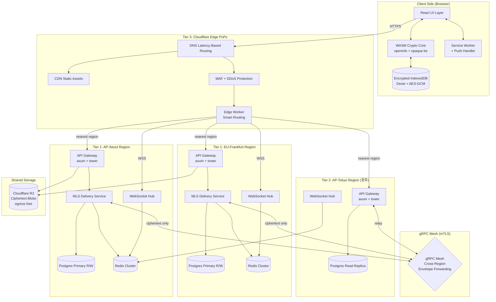

### 4.2 핵심 시퀀스: 1:1 대화 시작 (MLS Welcome)

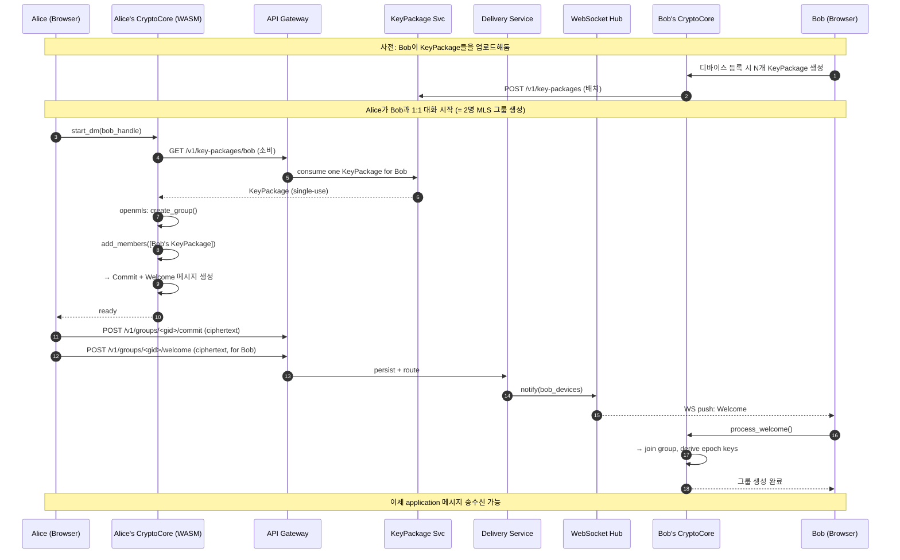

### 4.3 핵심 시퀀스: 크로스 리전 Application 메시지 송신

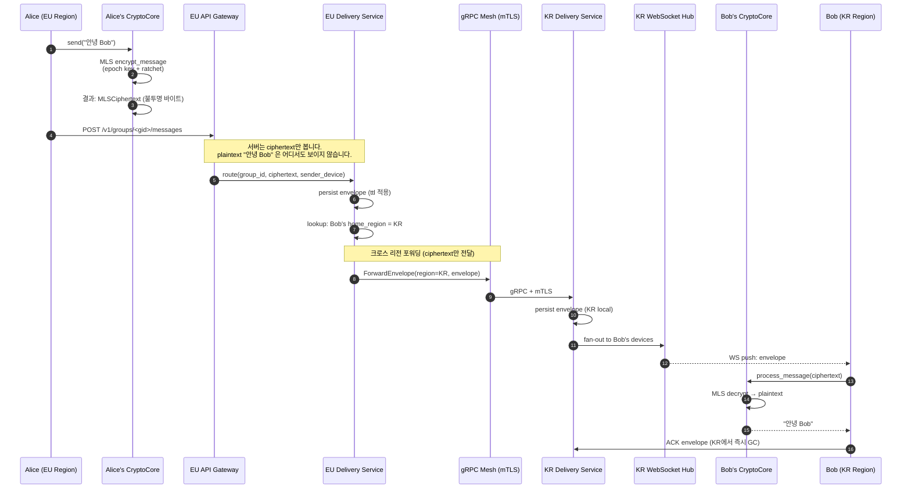

### 4.4 컴포넌트 책임 분리

| 컴포넌트 | 책임 | 절대 하지 않는 것 |
|---|---|---|
| Crypto Core (WASM) | MLS 그룹 상태, 암복호화, KeyPackage 생성 | 네트워크 통신 |
| UI Layer | 입력/표시/상호작용 | 키 직접 다루기 |
| Local DB | 암호화된 메시지/MLS 상태 영속화 | 평문 저장 |
| API Gateway | 인증, 라우팅, rate limit | 콘텐츠 검사 |
| KeyPackage Service | KeyPackage 발급 (1회 소비) | 개인키 보관 |
| MLS Delivery Service | Welcome/Commit/Application msg 라우팅 | ciphertext 복호화 시도 |
| MediaService | 암호화된 blob 업로드/다운로드 | 미디어 변환/썸네일 |
| gRPC Mesh | 리전 간 envelope 포워딩 (ciphertext only) | 메시지 내용 접근, 복호화 |
| Edge Worker (Cloudflare) | 레이턴시 기반 스마트 라우팅, WS 종단 | 상태 저장, envelope 캐싱 |
| Region Router | 사용자 home_region 기반 라우팅 결정 | 라우팅 외 데이터 처리 |

---

## 4A. 멀티 리전 아키텍처

### 4A.1 리전 토폴로지

| Tier | 리전 | 역할 | 인프라 |
|------|------|------|--------|
| Tier 1 | EU-Frankfurt | 풀 R/W Postgres, 사용자 데이터 소유 | Hetzner Cloud nbg1 (k3s HA) |
| Tier 1 | AP-Seoul (스테이징: Hetzner sin1 Singapore) | 풀 R/W Postgres, 사용자 데이터 소유 | Hetzner Cloud sin1 (k3s HA) — **PIPA 주의**: 실제 KR 사용자 데이터는 한국 내 DC 확보 후 이전 예정 (현재 스테이징 전용) |
| Tier 2 | AP-Tokyo (향후) | Read Replica + 릴레이, 쓰기는 Tier 1 포워딩 | Oracle Cloud (k3s) |
| Tier 2 | US-Ashburn (향후) | Read Replica + 릴레이, 쓰기는 Tier 1 포워딩 | 미정 |
| Tier 3 | Cloudflare Edge PoPs | WS 종단, 스마트 라우팅만, 상태 없음 | Cloudflare Workers |

**Tier 설계 원칙:**

- **Tier 1**: 완전한 독립 운영 가능. 자체 Postgres primary, Redis, 모든 서비스 스택. 사용자 데이터의 물리적 소유자.
- **Tier 2**: Tier 1의 read replica로 읽기 부하 분산. 쓰기는 해당 사용자의 home region Tier 1으로 gRPC 포워딩.
- **Tier 3**: 상태 없는 엣지. 가장 가까운 Tier 1/2로 트래픽 프록시. WebSocket 종단점 역할.

### 4A.2 라우팅 전략

**DNS 레이턴시 기반 라우팅:**

1. Cloudflare DNS가 클라이언트 위치 기반으로 가장 가까운 Edge PoP으로 라우팅
2. Edge Worker가 클라이언트 요청의 `Cf-IPCountry` 헤더 또는 명시적 `X-Preferred-Region` 헤더로 최적 백엔드 리전 결정
3. 신규 사용자는 최초 등록 리전이 home_region으로 설정

**클라이언트 리전 감지:**

```
1. 클라이언트 초기화 시 /v1/region/detect 호출
2. Edge Worker가 지리적 위치 기반 추천 리전 반환
3. 사용자가 명시적으로 home_region 선택 가능 (데이터 거주성 고려)
4. 이후 모든 요청은 home_region 기반 라우팅
```

### 4A.3 데이터 파티셔닝

**사용자/그룹별 home region:**

- `users.home_region`: 사용자 등록 시 결정, 변경 가능 (마이그레이션 필요)
- `groups.home_region`: 그룹 생성자의 home_region으로 초기화. MLS commit 직렬화 포인트.
- **원칙**: 사용자 데이터(identity, OPAQUE envelope, devices)는 home_region에만 물리 저장

**Envelope 포워딩:**

- Envelope은 복제되지 않음. 수신자의 home_region으로 gRPC 포워딩.
- 포워딩된 envelope은 수신 리전에서 영속화 후 WebSocket으로 전달.
- 발신 리전에서는 "전달 완료" 확인 후 로컬 envelope 삭제.

**KeyPackage 복제:**

- KeyPackage는 **모든 Tier 1 리전에 복제**. 어느 리전의 사용자든 다른 리전 사용자의 KeyPackage를 소비할 수 있어야 함.
- 소비(consume)는 home_region에서만 확정. 타 리전에서 소비 요청 시 home_region에 동기적 확인.

### 4A.4 리전 간 통신: gRPC + mTLS

**gRPC 서비스 정의:**

```protobuf
service RegionService {
    // Envelope 포워딩 (Application, Welcome, Commit)
    rpc ForwardEnvelope(ForwardEnvelopeRequest) returns (ForwardEnvelopeResponse);

    // MLS Commit 포워딩 (그룹 home region으로)
    rpc ForwardCommit(ForwardCommitRequest) returns (ForwardCommitResponse);

    // 그룹 멤버십 동기화
    rpc SyncGroupMembership(SyncGroupMembershipRequest) returns (SyncGroupMembershipResponse);

    // KeyPackage 소비 확인
    rpc ConsumeKeyPackage(ConsumeKeyPackageRequest) returns (ConsumeKeyPackageResponse);

    // 헬스 체크
    rpc HealthCheck(HealthCheckRequest) returns (HealthCheckResponse);
}
```

**mTLS 설정:**

- 리전 간 모든 gRPC 통신은 mTLS (상호 TLS 인증)
- 인증서: 자체 CA 운영 (각 리전별 인증서 발급)
- `rustls` 기반, 시스템 OpenSSL 비의존

**Retry / Circuit Breaker:**

- 일시적 실패: 지수 백오프 재시도 (최대 3회, 100ms → 200ms → 400ms)
- 지속적 실패: circuit breaker 활성화 (5초 half-open, 30초 open)
- circuit open 상태에서는 envelope 로컬 큐잉 → 연결 복구 후 일괄 포워딩

### 4A.5 MLS 커밋 직렬화

**핵심 원칙**: 그룹의 home_region이 유일한 MLS commit 직렬화 포인트.

```
1. 모든 commit 메시지는 그룹의 home_region DS로 라우팅
2. home_region DS가 epoch 순서 보장 (동시 commit 시 첫 번째만 수락)
3. 수락된 commit은 모든 관련 리전으로 fan-out
4. 거부된 commit → 클라이언트에 CONFLICT 응답 → 재시도
```

**크로스 리전 commit 흐름:**

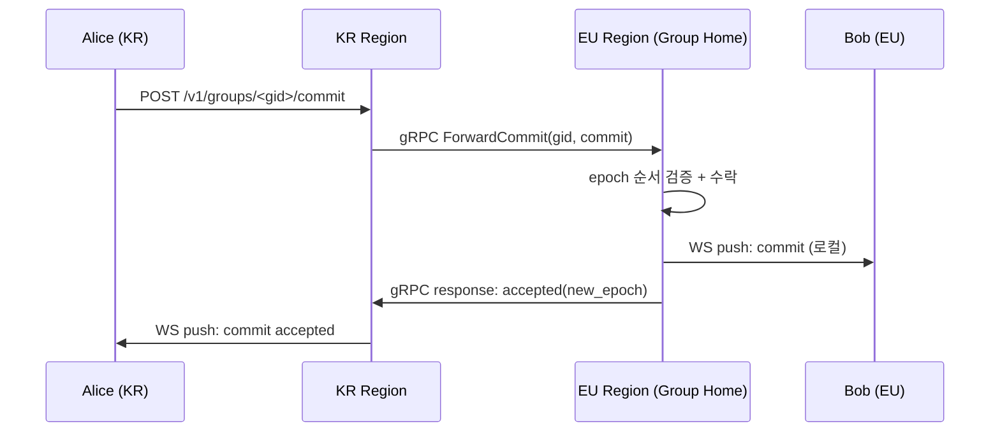

### 4A.6 데이터 거주성

**리전별 관할 요구 매트릭스:**

| 데이터 유형 | EU (GDPR) | KR (PIPA) | JP (APPI) |
|---|---|---|---|
| 사용자 identity (OPAQUE) | EU 리전에 저장 | KR 리전에 저장 | JP 리전에 저장 |
| Envelope (ciphertext) | home_region | home_region | home_region |
| KeyPackage | 전 리전 복제 (공개키만) | 전 리전 복제 | 전 리전 복제 |
| 미디어 blob (R2) | Cloudflare R2 (글로벌, ciphertext) | 동일 | 동일 |
| 로그/메트릭 | 리전 로컬 보관 | 리전 로컬 보관 | 리전 로컬 보관 |
| 백업 | 리전 로컬 | 리전 로컬 | 리전 로컬 |

**원칙**: 사용자 PII (handle_hash, OPAQUE envelope, device 정보)는 절대 home_region 밖으로 나가지 않음. 크로스 리전 전달되는 것은 ciphertext envelope과 공개 KeyPackage뿐.

### 4A.7 글로벌 장애 복구

**시나리오별 RTO/RPO 타깃:**

| 시나리오 | RTO | RPO | 복구 전략 |
|---|---|---|---|
| 단일 Tier 1 리전 장애 | <5분 | <30초 | 타 Tier 1 리전이 장애 리전 사용자 트래픽 수용. DNS 자동 페일오버. 쓰기는 큐잉 후 복구 시 재생. |
| Tier 2 리전 장애 | <1분 | 0 | 트래픽을 Tier 1으로 자동 리다이렉트. 데이터 손실 없음. |
| gRPC 메시 장애 | <30초 | <10초 | 크로스 리전 메시지 로컬 큐잉. 연결 복구 후 일괄 전달. 리전 내 메시지는 영향 없음. |
| 전체 리전 장애 (모든 Tier 1) | <30분 | <5분 | IaC 기반 신규 리전 프로비저닝. R2 blob은 Cloudflare 자체 복원. Postgres WAL 백업에서 복구. |
| Cloudflare Edge 장애 | <2분 | 0 | 클라이언트가 직접 Tier 1 리전 IP로 폴백 (클라이언트 내장 fallback URL). |

**자동 페일오버 메커니즘:**

1. 각 리전은 30초 간격으로 상호 health check (gRPC HealthCheck)
2. 3회 연속 실패 시 해당 리전 "degraded" 판정
3. Cloudflare Workers가 DNS 가중치 자동 조정 (degraded 리전 가중치 0)
4. 복구 감지 시 점진적 가중치 복원 (canary 5% → 25% → 50% → 100%)

---

## 5. 암호화 프로토콜 (MLS 기반)

### 5.1 라이브러리 채택: OpenMLS

**왜 Signal Protocol이 아닌 MLS인가** — 자세한 의사결정 근거는 §16 부록 B 참고.

요약:
- **라이선스**: Signal 공식 `libsignal`은 AGPLv3로 strong copyleft 영향, 외부 프로젝트 사용 비권장. `openmls`는 MIT/Apache 듀얼 라이선스.
- **표준**: MLS는 IETF RFC 9420 표준. 미래 호환성 보장.
- **WASM 공식 지원**: `openmls`는 `wasm_js` feature 제공.
- **1:1과 그룹 통일**: 1:1을 2명 그룹으로 모델링 → 코드 분기 제거.
- **활발한 유지보수**: 0.7.2 (2026.02) 출시, 정기 릴리스.
- **검증된 사용 사례**: Cisco WebEx, Wire 등.

**선택된 ciphersuite (MVP):**
```
MLS_128_DHKEMX25519_AES128GCM_SHA256_Ed25519 (MTI, 호환성)
```

향후 PQ ciphersuite가 OpenMLS에 안정 지원되면 다음으로 전환:
```
MLS_128_X25519_KYBER768_AES128GCM_SHA256_Ed25519 (draft, 하이브리드)
```

### 5.2 MLS 핵심 개념

#### 5.2.1 KeyPackage

X3DH의 PreKey Bundle에 대응. 사용자가 사전 업로드해두는 키 묶음:
- LeafNode (identity 키 포함, 서명됨)
- HPKE init key (1회 사용)
- Capabilities 선언 (지원 ciphersuite 등)

서버에는 다량 보관, 그룹 생성/초대 시 1개씩 소비.

#### 5.2.2 그룹 상태 (Group State)

MLS는 그룹의 모든 멤버가 동일한 **TreeKEM** 트리 상태를 유지합니다:
- 각 epoch마다 새로운 비밀에서 application key 파생
- 멤버 추가/제거 시 commit → 새 epoch 진입
- 트리 구조 덕분에 N명 그룹에서 키 갱신이 O(log N)

#### 5.2.3 메시지 종류

| 종류 | 용도 |
|---|---|
| KeyPackage | 서버에 사전 업로드되는 join 자격 |
| Welcome | 새 멤버에게 그룹 상태 전달 (암호화됨) |
| Commit | 그룹 상태 변경 (멤버 추가/제거/키 갱신) |
| Application | 실제 사용자 메시지 |

### 5.3 Post-Quantum: Day-1 하이브리드

**원칙**: "Harvest now, decrypt later" 공격이 현재 진행형이므로, 신규 프로젝트는 PQ 없이 시작하지 않습니다.

**전략** (상세 마이그레이션 가이드: `docs/decisions/0003-pq-migration.md`):

1. **Phase B interim (현재 배포됨)**: 클래식 MLS ciphersuite(`MLS_128_DHKEMX25519_AES128GCM_SHA256_Ed25519`) 위에 Powehi 전용 KeyPackage extension으로 ML-KEM-768 키를 embed. 그룹 초대 시 PQ 공유 비밀을 교환하고 HKDF-SHA256으로 바인딩을 유도. Raw decap key(2,400 bytes)는 WASM 경계를 절대 벗어나지 않음.
2. **Phase A (Native MLS PQ)**: `openmls`가 `MLS_128_MLKEM768_AES128GCM_SHA256_MlDsa65` ciphersuite를 stable 릴리스로 제공하면 발동. 새 그룹은 PQ ciphersuite로 생성; 기존 그룹은 클래식 유지 (90일 전환 창). 기능 플래그 `POWEHI_PQ_MLS_NATIVE_ENABLED` 로 점진 롤아웃.
3. **Phase B (X25519 deprecate)**: 활성 세션의 ≥ 95%가 Phase A 클라이언트를 사용하면 발동. 신규 클래식 KeyPackage 업로드 거부(HTTP 422), 기존 클래식 그룹에 인밴드 마이그레이션 공지.
4. **Phase C (X25519 제거)**: 활성 세션의 ≤ 0.1%만 클래식 KeyPackage를 보유하면 발동. 서버에서 비-PQ ciphersuite 하드 거부. **비가역적** — 클라이언트 버전 강제 업그레이드 게이트 필요.

**현재 구현 상태 (Phase B interim):**

| 컴포넌트 | 파일 | 상태 |
|---|---|---|
| ML-KEM-768 keygen / encap / decap | `crates/client/powehi-crypto-wasm/src/kem.rs` | 배포 완료 |
| NIST ACVP FIPS 203 KAT (encap+decap) | `kem.rs` (cfg(test)) | 통과 |
| PQ extension embed (encap key + Ed25519 sig) | `wasm_exports.rs` `pq_build_payload` | 배포 완료 |
| PQ encap key 추출 + 서명 검증 | `wasm_exports.rs` `mls_pq_extract_and_verify_encap_key` | 배포 완료 |
| PQ 바인딩 HKDF 유도 | `wasm_exports.rs` `mls_pq_derive_binding` | 배포 완료 |
| 초대 수락 시 PQ init 전송 | `app/src/components/AcceptInviteModal.tsx` | 배포 완료 |
| pq_init 수신 처리 | `app/src/hooks/useMessages.ts` | 배포 완료 |

**ML-KEM-768 크기 영향 (Phase A native 전환 시):**
- Encapsulation key: 1,184 bytes (X25519: 32 bytes, +1,152 bytes)
- Ciphertext (Welcome): 1,088 bytes (X25519: 32 bytes, +1,056 bytes)
- ML-DSA-65 서명: 3,293 bytes (Ed25519: 64 bytes, +3,229 bytes)
- KeyPackage 총 크기: 약 8,000 bytes (클래식: ~500 bytes, ~16×)
- 완화: KeyPackage rotation 주기 조정, 클라이언트 prefetch 캐싱, WASM 번들 예산 재검토.

**PQ extension 와이어 포맷 (현재):**
```
POWEHI_PQ_KEM_EXT_TYPE extension payload (1,248 bytes):
  bytes [0..1183]    — ML-KEM-768 encapsulation key (FIPS 203 §5)
  bytes [1184..1247] — Ed25519 signature (MLS identity key로 encap key에 서명)
```

### 5.4 MLS Delivery Service의 책임

서버가 수행해야 할 것 (모두 ciphertext만 다룸):

1. **KeyPackage 보관소**: 디바이스별 KeyPackage 풀 유지
2. **순서 보장**: epoch별 commit 메시지 순서 보장 (동시 commit 시 첫 번째만 수락, 나머지는 거부 → 클라이언트 재시도)
3. **Fan-out**: 그룹 멤버에게 메시지 배포 (sender 제외)
4. **외부 commit 검증**: 외부에서 그룹 가입(예: 링크) 시의 commit 검증

서버는 `(group_id, device_id)` 멤버십 매핑을 fan-out 및 미디어 ACL 목적으로 알고 있습니다. 단, MLS의 `LeafNode` 암호화 자료(공개 키, 서명 키, credential bytes 등 GroupContext 내 암호화 자료)는 평문으로 **알지 못합니다**. MLS GroupContext 전체가 클라이언트 측 암호화된 상태로만 처리됩니다. (§3.3 참고)

### 5.5 인증: OPAQUE (RFC 9807)

비밀번호를 서버가 절대 보지 않는 aPAKE 프로토콜.

**채택 라이브러리**: `facebook/opaque-ke` v4.x
- RFC 9807 준수
- NCC Group 감사 완료 (2021년, WhatsApp 후원)
- WASM 패키지 존재: `@serenity-kit/opaque`, `opaque-wasm`
- React Native 패키지: `react-native-opaque` (미래 모바일 호환)

```
[기존 방식]
Client → password (over TLS) → Server (sees pw briefly)

[OPAQUE]
Client ←→ multi-round PAKE handshake ←→ Server
Server stores: opaque_envelope (no plaintext password ever)
```

### 5.6 Safety Numbers (멤버 검증)

MLS에는 각 멤버의 identity 키가 있습니다. 두 사용자가 동일 그룹에서 보는 identity 키 hash를 비교하여 MITM 여부를 검증할 수 있습니다.

UX:
- QR 코드 (대면 시)
- 숫자 6자리 그룹 (전화 통화 등으로 음성 비교)
- 최초 1회 검증 → "verified" 상태 표시
- identity 키 변경 시 (디바이스 재등록 등) 즉시 alert

---

## 6. 백엔드 (Rust) 설계 — Hexagonal Architecture

### 6.1 크레이트 구성 (Cargo Workspace — Hexagonal)

```
powehi/
├── Cargo.toml                         # workspace root
├── crates/
│   ├── domain/
│   │   └── powehi-domain/             # 순수 도메인: Entity, VO, Event
│   │       ├── src/
│   │       │   ├── user.rs            # User, Device, Credential
│   │       │   ├── device.rs          # Device entity
│   │       │   ├── group.rs           # Group, GroupMember
│   │       │   ├── envelope.rs        # Envelope, MessageType
│   │       │   ├── key_package.rs     # KeyPackage value object
│   │       │   ├── media.rs           # MediaBlob metadata
│   │       │   ├── region.rs          # RegionId, HomeRegion, Tier
│   │       │   ├── error.rs           # 도메인 에러 타입
│   │       │   └── event.rs           # 도메인 이벤트 (UserRegistered, EnvelopeReceived 등)
│   │       └── Cargo.toml             # serde derive만, 외부 의존성 ZERO
│   │
│   ├── ports/
│   │   ├── powehi-port-inbound/       # 유스케이스 trait 정의
│   │   │   └── src/
│   │   │       ├── auth.rs            # AuthUseCase
│   │   │       ├── messaging.rs       # MessagingUseCase
│   │   │       ├── group.rs           # GroupUseCase
│   │   │       ├── key_package.rs     # KeyPackageUseCase
│   │   │       └── media.rs           # MediaUseCase
│   │   │
│   │   └── powehi-port-outbound/      # 레포지토리 / 외부 서비스 trait 정의
│   │       └── src/
│   │           ├── user_repo.rs       # UserRepository trait
│   │           ├── device_repo.rs     # DeviceRepository trait
│   │           ├── envelope_repo.rs   # EnvelopeRepository trait
│   │           ├── group_repo.rs      # GroupRepository trait
│   │           ├── key_package_repo.rs # KeyPackageRepository trait
│   │           ├── media_repo.rs      # MediaRepository trait
│   │           ├── region_router.rs   # RegionRouter trait (멀티 리전 라우팅)
│   │           ├── event_bus.rs       # DomainEventBus trait
│   │           └── cache.rs           # CachePort trait
│   │
│   ├── application/
│   │   └── powehi-application/        # 유스케이스 구현 (port trait만 의존)
│   │       └── src/
│   │           ├── auth_service.rs
│   │           ├── messaging_service.rs
│   │           ├── group_service.rs
│   │           ├── key_package_service.rs
│   │           └── media_service.rs
│   │
│   ├── adapters/
│   │   ├── inbound/
│   │   │   ├── powehi-rest-api/       # axum REST 핸들러
│   │   │   ├── powehi-ws-hub/         # WebSocket 허브
│   │   │   └── powehi-grpc/           # gRPC 리전 간 통신 (tonic)
│   │   └── outbound/
│   │       ├── powehi-postgres/       # Postgres 레포지토리 구현
│   │       ├── powehi-redis/          # Redis 캐시/이벤트 버스 구현
│   │       ├── powehi-r2/             # R2/S3 미디어 저장소 구현
│   │       ├── powehi-opaque/         # OPAQUE 인증 어댑터
│   │       ├── powehi-mls/            # OpenMLS 서버 사이드 어댑터
│   │       └── powehi-webpush/        # Web Push 어댑터
│   │
│   ├── infra/
│   │   ├── powehi-config/             # 리전 인식 설정 (region_id, tier 등)
│   │   ├── powehi-telemetry/          # OpenTelemetry 초기화
│   │   └── powehi-proto/              # Protobuf 정의 + prost 생성
│   │
│   └── client/
│       └── powehi-crypto-wasm/        # 브라우저 WASM (openmls 래핑)
│
└── bin/
    └── powehi-server/                 # Composition Root (DI 와이어링)
```

### 6.1.1 헥사고날 원칙

**의존성 방향 (Dependency Rule):**

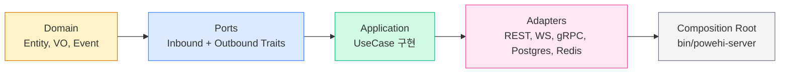

**화살표 방향 = 의존 방향. 안쪽(Domain)은 바깥쪽(Adapters)을 절대 알지 못합니다.**

- `powehi-domain`: 외부 의존성 ZERO. `serde` derive만 허용. `tokio`, `axum`, `sqlx` 등 절대 import 불가.
- `powehi-port-*`: `powehi-domain`만 의존. 구현체를 모름.
- `powehi-application`: `powehi-domain` + `powehi-port-*`만 의존. 어댑터를 모름.
- `powehi-*` (adapters): application + ports + domain 의존. 구체적 기술(sqlx, tonic, axum) 사용.
- `bin/powehi-server`: 모든 크레이트를 의존. 여기서만 DI 와이어링.

**컴파일 타임 강제**: 별도 크레이트 = Cargo.toml의 `[dependencies]`에 명시하지 않으면 import 자체가 불가. 아키텍처 규칙이 컴파일러에 의해 강제됨.

### 6.1.2 핵심 Trait 시그니처

**Inbound Ports (유스케이스):**

```rust
// powehi-port-inbound/src/auth.rs
#[async_trait]
pub trait AuthUseCase: Send + Sync {
    async fn register_init(&self, req: RegistrationInitRequest) -> Result<RegistrationInitResponse, DomainError>;
    async fn register_finish(&self, req: RegistrationFinishRequest) -> Result<UserId, DomainError>;
    async fn login_init(&self, req: LoginInitRequest) -> Result<LoginInitResponse, DomainError>;
    async fn login_finish(&self, req: LoginFinishRequest) -> Result<SessionToken, DomainError>;
    async fn register_device(&self, user_id: &UserId, req: DeviceRegistrationRequest) -> Result<DeviceId, DomainError>;
    async fn revoke_device(&self, user_id: &UserId, device_id: &DeviceId) -> Result<(), DomainError>;
}

// powehi-port-inbound/src/messaging.rs
#[async_trait]
pub trait MessagingUseCase: Send + Sync {
    async fn send_message(&self, sender: &DeviceId, group_id: &GroupId, ciphertext: Bytes) -> Result<EnvelopeId, DomainError>;
    async fn send_welcome(&self, sender: &DeviceId, group_id: &GroupId, welcome: Bytes, target: &DeviceId) -> Result<(), DomainError>;
    async fn send_commit(&self, sender: &DeviceId, group_id: &GroupId, commit: Bytes) -> Result<Epoch, DomainError>;
    async fn poll_envelopes(&self, device_id: &DeviceId, since: Option<DateTime>) -> Result<Vec<Envelope>, DomainError>;
    async fn ack_envelope(&self, device_id: &DeviceId, envelope_id: &EnvelopeId) -> Result<(), DomainError>;
}

// powehi-port-inbound/src/group.rs
#[async_trait]
pub trait GroupUseCase: Send + Sync {
    async fn create_group(&self, creator: &DeviceId, group_id: GroupId) -> Result<(), DomainError>;
    async fn add_member(&self, group_id: &GroupId, device_id: &DeviceId, epoch: Epoch) -> Result<(), DomainError>;
    async fn remove_member(&self, group_id: &GroupId, device_id: &DeviceId, epoch: Epoch) -> Result<(), DomainError>;
}
```

**Outbound Ports (레포지토리/서비스):**

```rust
// powehi-port-outbound/src/user_repo.rs
#[async_trait]
pub trait UserRepository: Send + Sync {
    async fn save(&self, user: &User) -> Result<(), DomainError>;
    async fn find_by_id(&self, id: &UserId) -> Result<Option<User>, DomainError>;
    async fn find_by_handle_hash(&self, hash: &[u8]) -> Result<Option<User>, DomainError>;
}

// powehi-port-outbound/src/envelope_repo.rs
#[async_trait]
pub trait EnvelopeRepository: Send + Sync {
    async fn save(&self, envelope: &Envelope) -> Result<(), DomainError>;
    async fn find_pending(&self, device_id: &DeviceId, since: Option<DateTime>) -> Result<Vec<Envelope>, DomainError>;
    async fn delete(&self, id: &EnvelopeId) -> Result<(), DomainError>;
    async fn delete_expired(&self) -> Result<u64, DomainError>;
}

// powehi-port-outbound/src/region_router.rs
#[async_trait]
pub trait RegionRouter: Send + Sync {
    /// 사용자의 home region 조회
    async fn resolve_home_region(&self, user_id: &UserId) -> Result<RegionId, DomainError>;
    /// 그룹의 home region 조회
    async fn resolve_group_region(&self, group_id: &GroupId) -> Result<RegionId, DomainError>;
    /// 크로스 리전 envelope 포워딩
    async fn forward_envelope(&self, target_region: &RegionId, envelope: &Envelope) -> Result<(), DomainError>;
    /// 크로스 리전 commit 포워딩
    async fn forward_commit(&self, target_region: &RegionId, group_id: &GroupId, commit: Bytes) -> Result<Epoch, DomainError>;
    /// 현재 리전이 해당 그룹의 home인지 확인
    fn is_local(&self, region: &RegionId) -> bool;
}

// powehi-port-outbound/src/event_bus.rs
#[async_trait]
pub trait DomainEventBus: Send + Sync {
    async fn publish(&self, event: DomainEvent) -> Result<(), DomainError>;
    async fn subscribe(&self, topic: &str) -> Result<EventStream, DomainError>;
}
```

### 6.1.3 Composition Root 패턴

`bin/powehi-server/main.rs`에서 모든 의존성을 와이어링합니다:

```rust
// 의사코드 — 실제 구현 시 Arc<dyn Trait> 패턴
#[tokio::main]
async fn main() -> Result<()> {
    // 1. 설정 로드 (리전 인식)
    let config = powehi_config::load()?;
    let region_id = config.region_id.clone();

    // 2. Outbound 어댑터 초기화
    let pg_pool = powehi_postgres::connect(&config.database_url).await?;
    let redis = powehi_redis::connect(&config.redis_url).await?;
    let r2 = powehi_r2::client(&config.r2_config)?;
    let opaque = powehi_opaque::server(&config.opaque_config)?;

    // 3. Outbound ports 구현체 생성
    let user_repo: Arc<dyn UserRepository> = Arc::new(PgUserRepository::new(pg_pool.clone()));
    let envelope_repo: Arc<dyn EnvelopeRepository> = Arc::new(PgEnvelopeRepository::new(pg_pool.clone()));
    let event_bus: Arc<dyn DomainEventBus> = Arc::new(RedisEventBus::new(redis.clone()));
    let region_router: Arc<dyn RegionRouter> = Arc::new(GrpcRegionRouter::new(&config.grpc_mesh));

    // 4. Application services (유스케이스 구현)
    let auth_svc: Arc<dyn AuthUseCase> = Arc::new(AuthService::new(user_repo.clone(), opaque));
    let msg_svc: Arc<dyn MessagingUseCase> = Arc::new(MessagingService::new(
        envelope_repo.clone(), event_bus.clone(), region_router.clone()
    ));

    // 5. Inbound 어댑터 (REST, WS, gRPC)
    let rest = powehi_rest_api::router(auth_svc.clone(), msg_svc.clone());
    let ws = powehi_ws_hub::hub(event_bus.clone(), redis.clone());
    let grpc = powehi_grpc::server(msg_svc.clone(), region_id);

    // 6. 서버 시작
    tokio::try_join!(
        axum::serve(listener, rest),
        ws.run(),
        grpc.serve(grpc_addr),
    )?;

    Ok(())
}
```

### 6.2 핵심 기술 스택

| 영역 | 선택 | 근거 |
|---|---|---|
| HTTP/WS 프레임워크 | `axum` 0.8 + `tower` | Rust 생태계 표준 |
| 비동기 런타임 | `tokio` | 사실상 표준 |
| DB 드라이버 | `sqlx` (Postgres) | 컴파일 타임 쿼리 검증 |
| 마이그레이션 | `sqlx-cli` 또는 `refinery` | 버전 관리된 마이그레이션 |
| 직렬화 | `prost` (protobuf) | 와이어 포맷 안정성 |
| Redis | `fred` 또는 `redis-rs` | pub/sub 및 큐 |
| S3 클라이언트 | `aws-sdk-s3` 또는 `rust-s3` | R2 호환 |
| MLS 프로토콜 | `openmls` 0.7+ | RFC 9420, MIT/Apache, WASM 지원 |
| OPAQUE | `opaque-ke` 4.x | RFC 9807, NCC 감사 |
| Web Push | `web-push` 크레이트 | RFC 8030/8291 |
| gRPC | `tonic` | Rust gRPC 표준, 리전 간 통신 |
| mTLS | `rustls` | 시스템 OpenSSL 비의존, 리전 간 상호 인증 |
| 로깅/트레이싱 | `tracing` + `opentelemetry` | 구조화 로그, 콘텐츠 비포함 |
| 테스트 | `cargo-nextest`, `testcontainers` | 빠른 병렬 테스트, 실제 DB 통합 |

### 6.3 핵심 API 설계 (REST + WebSocket + gRPC)

#### 인증 (OPAQUE)

```
POST   /v1/auth/register/init         OPAQUE 등록 1단계 (RegistrationRequest)
POST   /v1/auth/register/finish       OPAQUE 등록 완료 (RegistrationUpload)
POST   /v1/auth/login/init            OPAQUE 로그인 1단계 (KE1)
POST   /v1/auth/login/finish          OPAQUE 로그인 완료 (KE3) → 세션 토큰
POST   /v1/auth/devices               신규 디바이스 등록 (기존 디바이스 인증 필요)
DELETE /v1/auth/devices/:id           디바이스 해지
```

#### KeyPackage

```
POST   /v1/key-packages               KeyPackage 일괄 업로드
GET    /v1/key-packages/:user_handle  KeyPackage 1개 소비
GET    /v1/key-packages/me/count      남은 KeyPackage 개수 (보충 필요 판단)
```

#### MLS 그룹 메시지

```
POST   /v1/groups/:gid/welcome        Welcome 메시지 송신 (특정 수신자)
POST   /v1/groups/:gid/commit         Commit 메시지 (순서 보장)
POST   /v1/groups/:gid/messages       Application 메시지
GET    /v1/groups/:gid/messages       미수신 envelope 폴링
DELETE /v1/groups/:gid/messages/:id   수신 확인 후 삭제
WSS    /v1/realtime                   실시간 envelope 수신
```

#### 미디어

```
POST   /v1/media/uploads              upload session 생성
PUT    /v1/media/uploads/:id          청크 업로드 (resumable, RFC 7233)
POST   /v1/media/uploads/:id/complete 업로드 완료
GET    /v1/media/:id                  presigned URL 발급 (R2 직접 다운로드)
```

#### 리전 (v3 신설)

```
GET    /v1/region/detect              클라이언트 위치 기반 추천 리전
GET    /v1/region/status              리전 상태 (health, load)
```

#### gRPC 서비스 (리전 간 내부 통신, §4A.4 참조)

```
RegionService.ForwardEnvelope        크로스 리전 envelope 포워딩
RegionService.ForwardCommit          크로스 리전 commit 포워딩
RegionService.SyncGroupMembership    그룹 멤버십 동기화
RegionService.ConsumeKeyPackage      KeyPackage 소비 확인
RegionService.HealthCheck            리전 간 헬스 체크
```

### 6.4 Rate Limiting & DoS 보호

서버는 콘텐츠를 모르지만, 라우팅 메타데이터는 보호해야 합니다.

**로컬 (리전 내) Fast-path:**
- IP 기반: `tower-governor` 미들웨어 (인메모리, 즉시 판정)
- envelope 크기 제한: 메시지 64KB, 미디어 청크 5MB
- 미디어 총량: 디바이스당 일일 1GB (조정 가능)

**글로벌 (리전 간) 분산:**
- User 기반: Redis 분산 토큰 버킷 (리전 로컬 Redis, 주기적 동기화)
- KeyPackage 소비: 동일 IP에서 분당 60회 제한 (정찰 공격 방지)
- 리전 간 abuse signal 동기화: 한 리전에서 차단된 IP/사용자 → 전 리전 전파 (Redis pub/sub 또는 gRPC)

**Rate Limit 아키텍처:**

```
요청 → tower-governor (로컬, <1ms) → Redis 토큰 버킷 (리전, <5ms) → 처리
                                              ↕
                                    크로스 리전 abuse 동기화 (비동기, 최종 일관성)
```

---

## 7. 프론트엔드 설계 (React 19 + Vite 6 + TanStack)

### 7.1 확정 스택

| 영역 | 선택 |
|---|---|
| 런타임 | React 19 |
| 빌드 | Vite 6 |
| 라우팅 | TanStack Router (타입 안전, 코드 스플리팅) |
| 상태 (전역) | Zustand |
| 상태 (서버) | TanStack Query (제한적 사용 — E2EE라 캐시 의미 적음) |
| 폼 | TanStack Form |
| 스타일링 | Tailwind v4 + OKLCH 토큰 시스템 |
| 컴포넌트 | Radix UI Primitives + 자체 디자인 |
| 크립토 | Comlink로 WASM Web Worker 추상화 |
| 저장소 | Dexie.js (IndexedDB 래퍼) + 자체 암호화 레이어 |
| i18n | Lingui (Korean, English, Japanese) |
| 테스트 | Vitest + Playwright |
| 포맷/린트 | Biome (eslint + prettier 통합) |

**i18n 확장 (v3):** 1차 지원 언어를 Korean/English에서 **Korean/English/Japanese**로 확장. 멀티 리전 배포에 맞춰 각 Tier 1/2 리전의 주요 언어를 day-1 지원합니다.

**타임존 처리:** 모든 타임스탬프는 UTC로 저장/전송. 클라이언트에서 `Intl.DateTimeFormat`으로 사용자 로컬 타임존 변환. 메시지 정렬은 서버 `received_at` (UTC) 기준.

### 7.2 핵심 레이어 구조

```
┌─────────────────────────────────────────────────┐
│  Presentation (React Components, Tailwind)      │
├─────────────────────────────────────────────────┤
│  Application (Zustand stores, route handlers)   │
├─────────────────────────────────────────────────┤
│  Domain (TypeScript types, MLS state model)     │
├─────────────────────────────────────────────────┤
│  Infrastructure                                  │
│  ├─ CryptoCore (WASM, openmls 기반)             │
│  ├─ LocalDB (Dexie + AES-GCM 자체 암호화 layer) │
│  ├─ Network (fetch, WebSocket)                  │
│  └─ Notifications (Service Worker + Web Push)   │
└─────────────────────────────────────────────────┘
```

### 7.3 WASM Crypto Core

- Rust로 작성된 `powehi-crypto-wasm` 크레이트를 `wasm-bindgen`으로 빌드
- 서버와 동일한 `openmls` 코드 공유 → 프로토콜 일관성
- 메인 스레드 차단 방지: **Web Worker** 안에서 실행
- 비밀 키는 Worker 안에서만 존재, 메인 스레드는 핸들만 보유

```
[Main Thread]                    [Crypto Worker (Comlink)]
   UI ─── postMessage ──────────►  WASM Module (openmls)
                                       │
                                       ├─ Identity Keys (in-memory)
                                       ├─ Group States (TreeKEM)
                                       └─ KeyPackage cache
   UI ◄── postMessage ──────────  결과만 반환 (ciphertext)
```

### 7.4 로컬 저장소 전략

**브라우저 환경의 제약:**
- localStorage: XSS에 취약, 절대 사용 X
- IndexedDB: 용량 충분, 그러나 평문 저장 시 위험
- File System Access API: 사용자 명시적 동의 필요, 제한적

**선택**: Dexie.js (IndexedDB) + 클라이언트 측 암호화 레이어

1. 사용자 passphrase → Argon2id → DB encryption key 파생
2. 모든 record는 AES-256-GCM으로 암호화 후 저장
3. 메모리 캐시는 휴면 시점 (visibilitychange) 또는 N분 후 자동 wipe
4. Dexie의 schema 정의로 type-safe 인덱스 활용

### 7.5 Service Worker 및 푸시 알림

**핵심**: 푸시 페이로드를 통한 메시지 내용 누출 방지.

**RFC 8291 표준 Web Push E2EE 사용:**
1. Service Worker가 등록 시 ECDH 공개키 생성 → 서버에 알림 가능 등록
2. 서버는 알림 발송 시 페이로드를 그 ECDH 키로 암호화
3. 푸시 서비스(FCM/APNs/Mozilla)는 페이로드 내용을 못 봄
4. Service Worker가 깨어나 페이로드 복호화
5. **단, 페이로드에 평문 메시지는 넣지 않음**. "새 메시지 있음" 정도의 자극만.
6. SW가 envelope를 가져와 MLS로 복호화 후 `showNotification`으로 실제 내용 표시

**iOS 호환:**
- iOS 16.4+ PWA 푸시 알림 지원
- Safari 18.4+ Declarative Web Push (SW 없이도 일부 동작)

### 7.6 Region-Aware Client Behavior

클라이언트는 멀티 리전 환경을 인식하고 최적의 UX를 제공합니다:

**리전 감지 및 선택:**
- 초기 로드 시 `/v1/region/detect`로 최적 리전 자동 감지
- 사용자가 설정에서 home_region 명시적 선택 가능 (데이터 거주성 UI)
- 리전 변경 시 마이그레이션 확인 다이얼로그

**연결 관리:**
- WebSocket은 현재 접속 리전의 ws-hub에 연결
- 크로스 리전 메시지는 서버 측에서 투명하게 포워딩 (클라이언트 비인지)
- 리전 장애 감지 시 자동 fallback URL로 재연결 (최대 3회 시도 후 사용자 알림)

**UX 표시:**
- 설정 > 데이터 거주성: 현재 home_region 및 데이터 저장 위치 표시
- 크로스 리전 메시지 전달 지연 시 "전송 중..." 상태 표시 (임계값: 500ms)
- 리전 상태 표시: 정상/지연/장애 (설정 > 서비스 상태)

---

## 8. 연락처 발견 (Contact Discovery)

### 8.1 결정: 익명 핸들 + 초대 링크/QR

**선택 이유**: 전화번호/이메일 매칭은 메타데이터 누출의 근본 원인. 부재 자체가 보안.

### 8.2 익명 핸들

- 사용자가 생성하는 공개 식별자 (예: `@aurora-fox-2843`)
- DB에는 `handle_hash`만 저장 (스키마 §10.1 참고)
- 핸들 자체로는 어떤 PII와도 매핑되지 않음
- 사용자가 알려준 사람만 추가 가능

### 8.3 초대 링크

URL 형식:
```
https://powehi.app/i/connect#<32-hex code>.<64-hex KeyPackage SHA-256 hash>
```

- fragment(`#` 이후) 부분은 브라우저 표준상 서버에 전송되지 않음 → 서버는 code도 hash도 모름
- 코드는 1회 사용, 24시간 만료

**MITM 방지 — KeyPackage hash pinning (cycle 299, 구현 완료):** 위 줄의 "토큰 안에는 초대자의
KeyPackage hash 등 검증 정보 포함"이 이제 실제로 구현됨. 초대자 클라이언트가 `mlsGetKeyPackage`로
새 KeyPackage를 직접 생성하고, 그 바이트를 로컬에서 SHA-256으로 해시한 뒤, 원본 바이트는
`POST /v1/invites` 바디로 서버에 전달(pin)하고 해시는 URL fragment에 담아 공유한다. 수신자는
`POST /v1/invites/redeem`으로 pin된 KeyPackage 바이트를 돌려받아 로컬에서 다시 SHA-256을 계산하고
fragment의 해시와 비교한다 — 일치하지 않으면 `mlsCreateGroup`/`mlsAddMember`/Welcome 전송 전에
즉시 중단한다. 서버는 이 해시를 계산하거나 반환하지 않는다(코드로 강제됨 — `create` 응답에
`key_package_hash` 필드 없음, 회귀 테스트로 검증). 이로써 서버가 (bytes, hash) 쌍을 동시에 조작해
검증을 무력화할 수 있는 경로가 구조적으로 차단된다 — 이전에는 수신자가
`GET /v1/key-packages/:deviceId`로 서버가 골라주는 KeyPackage를 그대로 신뢰해야 했음(§3.1 서버
운영자 위협 T3에 대한 방어 강화).

**범위의 한계:** 이 pin은 "서버가 KeyPackage를 바꿔치기"하는 공격(T3)만 막는다. 초대 링크 자체를
전달하는 out-of-band 채널(악성 링크 단축 서비스, 바꿔치기된 QR 이미지 등)이 손상된 경우는 여전히
방어 범위 밖이며 — code와 hash를 한 쌍으로 함께 위조하면 자기 일관적인 가짜 초대를 만들 수 있다.
이는 §8.4의 대면 QR 교환(신뢰할 수 있는 채널 가정)과 이후의 Safety Number 검증이 다루는 T2 영역으로,
이번 변경으로 새로 생기거나 악화된 gap이 아니다.

### 8.4 QR 코드

- 위 초대 링크 자체를 QR로 인코딩
- 대면 만남 시 사용 (MITM 방지 보너스)

### 8.5 회복 매커니즘 (분실 시)

전화번호/이메일이 없으므로, 디바이스 분실 시 별도의 recovery code (passphrase) 필요:
- 등록 시 사용자에게 24개 BIP-39 단어 제공
- 사용자가 안전한 곳에 보관 (종이, 비밀번호 관리자 등)
- 신규 디바이스에서 복원 시 사용
- 단, 메시지 내용 복원이 아닌 **계정/identity 키 복원**만. (메시지 백업은 별도 옵션)

**구현 결정 (cycle 113, crypto-reviewer 검토 완료):**
- 엔트로피: CSPRNG 256비트 → BIP-39 24단어 (표준 BIP-39)
- 시드 유도: PBKDF2-HMAC-SHA512 (BIP-39 표준, 반복 2048회)
- **BIP-39 패스프레이즈 없음 (empty passphrase):** CSPRNG 생성 니모닉은 256비트 엔트로피를 가지므로 추가 패스프레이즈 없이도 무차별 대입 공격에 안전. 24단어 자체가 유일한 복구 비밀.
- MLS 서명 키 유도: HKDF-SHA256(salt=None, info=b"powehi-mls-signing-v1", L=32) → Ed25519 개인 키
- 개인 키는 WASM 경계를 절대 넘지 않음; 브라우저 JS로 노출되지 않음
- 니모닉은 등록 시 1회만 표시되며 절대 저장되지 않음 (IndexedDB/localStorage 저장 금지)

**서버 검증 복원 프로토콜 (cycle 303/304, threat-model-checker + crypto-reviewer + security-auditor 검토 완료):**

디바이스를 전부 분실한 사용자(로컬 세션/디바이스 행이 전혀 없음)가 비밀번호와 복구 문구만으로 새 디바이스를 등록하는 흐름:

- **별도 키 유도 (§3.3 참조):** 복구 인증에는 MLS 서명 키가 아닌, HKDF-SHA256(salt=None, info=b"powehi-recovery-auth-v1", L=32)로 유도되는 **독립된** Ed25519 키 쌍을 사용함. 공개 키(`recovery_pubkey`)만 등록 시 1회 서버로 전송되어 `users.recovery_pubkey`에 영구 저장됨(§3.3). 이 도메인 분리가 없다면 서버가 영구 저장하는 값이 MLS 서명 키와 동일해져 §3.3 "서버가 알지 못하는 것" 원칙을 위반하게 됨 — 두 키가 같은 BIP-39 시드에서 나오더라도 서로 다른 HKDF info 라벨을 쓰면 계산적으로 무관한 별개의 32바이트 값이 됨.
- **도전-응답 서명:** 복원 로그인 시 서버가 `login_init`에서 발급한 1회용 `login_nonce`(UUID 문자열)에 대해, 클라이언트가 `powehi-recovery-auth-v1` 키로 `b"powehi-recovery-challenge-v1" ‖ 0x00 ‖ login_nonce_utf8` 메시지에 서명(도메인 분리 라벨 + NUL 구분자로 서버가 임의로 선택한 nonce에 대한 cross-protocol 서명 confusion을 방지). 서버는 `recovery_pubkey`로 `verify_strict`(RFC 8032 비-정규 인코딩 거부) 검증.
- **2요소 게이팅 (권한 상승 없음):** 이 경로는 OPAQUE 로그인(비밀번호)이 먼저 성공한 뒤에만 도달하며(`login_finish` 내부, 미지의 `device_id` + `recovery_proof` 존재 시), 복구 문구 서명이 추가로 필요함 — 즉 기존 로그인보다 요구 조건이 하나 더 추가되는 것이지, 어떤 기존 인증 요소도 우회하지 않음.
- **오라클 방지:** 계정 미등록(`recovery_pubkey = NULL`)·서명 malformed·서명 검증 실패·디바이스 정원 초과 등 모든 실패 모드가 동일한 `Unauthorized`로 수렴함(비인증 호출자에게 계정 상태를 구분시키지 않음). 미등록 계정도 고정된 더미 공개 키로 동일하게 `verify_strict`를 실행해 타이밍 오라클을 차단함.
- **그룹 상태에는 영향 없음:** 복원된 디바이스는 새 MLS credential로 `devices` 테이블에만 추가되며, 어떤 그룹 멤버십도 자동으로 얻지 않음 — 기존 그룹에 재합류하려면 기존 멤버의 MLS Commit이 필요하고, identity 키 변경은 §5.6 Safety Number 경고를 발생시킴(포워드 시크러시/PCS 영향 없음).

---

## 9. 미디어 처리

### 9.1 핵심 원칙

미디어도 메시지와 동일하게 **서버는 ciphertext blob만 봅니다.** 다만 미디어는 크기가 크고 재전송이 비싸므로 별도 키 전략을 사용합니다.

### 9.2 미디어 암호화 흐름

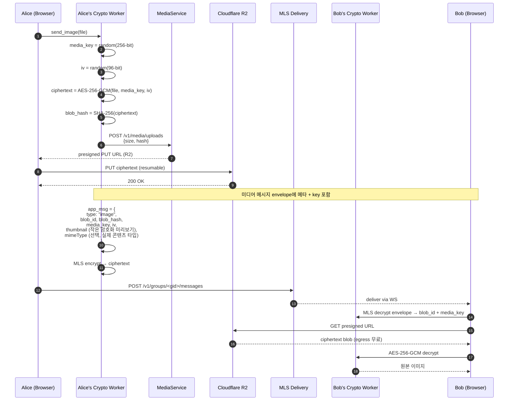

### 9.3 미디어 저장소: Cloudflare R2

**선택 이유:**
1. **Egress 무료** — 미디어 다운로드 비용 폭주 방지 (`R2 doesn't charge for egress`)
2. **S3 호환 API** — 표준 SDK 사용
3. **Zero-knowledge 무손실** — 어차피 ciphertext blob만 저장하므로 외부 서비스 사용 안전
4. **이식성** — Garage/MinIO로 자체 호스팅 전환 가능

**역할 분리:**
- R2는 **blob 저장 전용**. WebSocket/API 서버 운영은 별개 (리전별 k3s).
- 메타데이터(blob_id, sha256, owner_user_id, expires_at)는 Postgres.

### 9.4 미디어 특수 처리

#### 9.4.1 썸네일

- 서버 측 썸네일 생성 = plaintext 접근 = **금지**
- 클라이언트가 원본을 다운스케일 → 작은 썸네일 별도 암호화 → envelope에 인라인 포함
- 또는: 별도의 작은 ciphertext blob으로 업로드

#### 9.4.2 스트리밍 (대용량 비디오)

- AES-256-GCM은 청크 단위로 안전. 청크별 IV 사용
- 청크 인덱스로 부분 다운로드 가능 → 점진적 재생
- 단, 청크 경계는 16MB 등 일정값으로 패딩 → 사이즈 누출 완화

#### 9.4.3 미디어 GC (Garbage Collection)

- 모든 수신자가 ACK 한 blob은 N일 후 자동 삭제. **ACK의 정의**: 수신자 디바이스가 해당 blob의 프리사인 다운로드 URL을 발급받은 시점 — 실제 바이트 전송이나 클라이언트 복호화 성공을 확인하지는 않음(서버는 클라이언트 로컬 상태를 알 수 없으므로 원천적으로 확인 불가). 그룹에 공유되지 않은 blob(업로더 전용)은 대기할 수신자가 없으므로 유예 기간만으로 GC 대상이 됨.
- N(기본 30일)은 업로드 시점 기준 유예 하한선이며, 명시적 `expires_at`이 설정된 경우 그 값이 우선함. 시간당 1회 백그라운드 스윕(`run_gc`)이 검사.
- 발신자가 보유한 키 없으면 영원히 복호화 불가 → 안전한 forgetting
- 메타데이터 노출 및 GC 타이밍 부산물(coarse read-receipt 추론 가능성)은 §3.3, §3.4 참조.

---

## 10. 데이터 모델 및 저장소

### 10.1 PostgreSQL 스키마 (서버가 보는 데이터)

**핵심 원칙**: 서버 DB에 plaintext 콘텐츠는 한 글자도 없습니다.

```sql
-- 사용자: ID와 OPAQUE envelope만 보유
CREATE TABLE users (
    id                  UUID PRIMARY KEY,
    handle_hash         BYTEA NOT NULL UNIQUE,    -- 핸들 자체가 아닌 해시
    opaque_registration BYTEA NOT NULL,           -- OPAQUE 등록 결과
    home_region         TEXT NOT NULL,             -- 사용자 데이터 소유 리전 (v3)
    created_at          TIMESTAMPTZ NOT NULL DEFAULT now()
);

-- 디바이스: 사용자당 N개
CREATE TABLE devices (
    id              UUID PRIMARY KEY,
    user_id         UUID NOT NULL REFERENCES users(id),
    -- MLS LeafNode의 signature key
    signature_pubkey BYTEA NOT NULL,
    last_seen_at    TIMESTAMPTZ,
    created_at      TIMESTAMPTZ NOT NULL DEFAULT now(),
    revoked_at      TIMESTAMPTZ
);

-- KeyPackage: 디바이스당 다량 보관, 1회 사용 후 삭제
CREATE TABLE key_packages (
    id              UUID PRIMARY KEY,
    device_id       UUID NOT NULL REFERENCES devices(id),
    key_package     BYTEA NOT NULL,               -- 직렬화된 MLS KeyPackage
    created_at      TIMESTAMPTZ NOT NULL DEFAULT now(),
    consumed_at     TIMESTAMPTZ                   -- NULL이면 사용 가능
);
CREATE INDEX ON key_packages (device_id) WHERE consumed_at IS NULL;

-- MLS 그룹: groups 테이블은 group_id, epoch만 저장. 멤버 목록은 아래 group_members 테이블에 별도 저장 (§3.3 참고)
CREATE TABLE groups (
    id              UUID PRIMARY KEY,
    home_region     TEXT NOT NULL,                 -- MLS commit 직렬화 리전 (v3)
    current_epoch   BIGINT NOT NULL DEFAULT 0,
    created_at      TIMESTAMPTZ NOT NULL DEFAULT now()
);

-- 그룹 멤버 라우팅 테이블: ciphertext fan-out 대상
CREATE TABLE group_members (
    group_id        UUID NOT NULL REFERENCES groups(id),
    device_id       UUID NOT NULL REFERENCES devices(id),
    added_at_epoch  BIGINT NOT NULL,
    removed_at_epoch BIGINT,                      -- NULL이면 현재 멤버
    PRIMARY KEY (group_id, device_id)
);

-- Envelope: 미수신 메시지 큐. ciphertext만 보유.
CREATE TABLE envelopes (
    id              UUID PRIMARY KEY,
    group_id        UUID NOT NULL REFERENCES groups(id),
    to_device_id    UUID NOT NULL REFERENCES devices(id),
    message_type    SMALLINT NOT NULL,            -- 1=Welcome, 2=Commit, 3=App
    ciphertext      BYTEA NOT NULL,               -- 서버 입장에서 불투명 바이트
    source_region   TEXT NOT NULL,                 -- 발신 리전 (v3)
    target_region   TEXT NOT NULL,                 -- 수신 리전 (v3)
    received_at     TIMESTAMPTZ NOT NULL DEFAULT now(),
    expires_at      TIMESTAMPTZ NOT NULL          -- TTL 적용
);
CREATE INDEX ON envelopes (to_device_id, received_at);

-- 미디어 메타: blob 자체는 R2, 메타만 여기
CREATE TABLE media_blobs (
    id          UUID PRIMARY KEY,
    size_bytes  BIGINT NOT NULL,
    sha256      BYTEA NOT NULL,
    r2_key      TEXT NOT NULL,
    uploaded_by UUID REFERENCES devices(id),       -- GC용
    uploaded_at TIMESTAMPTZ NOT NULL DEFAULT now(),
    expires_at  TIMESTAMPTZ NOT NULL
);

-- 리전 라우팅 테이블: 리전 간 라우팅 메타데이터 (v3 신설)
CREATE TABLE region_routing (
    region_id       TEXT PRIMARY KEY,              -- 예: 'eu-frankfurt', 'ap-seoul'
    tier            SMALLINT NOT NULL,             -- 1, 2, 3
    grpc_endpoint   TEXT NOT NULL,                 -- gRPC 메시 엔드포인트
    status          TEXT NOT NULL DEFAULT 'active', -- active, degraded, down
    last_health_at  TIMESTAMPTZ,
    updated_at      TIMESTAMPTZ NOT NULL DEFAULT now()
);
```

**스키마에 의도적으로 없는 것들:**
- `messages.content` — 평문 메시지 본문 컬럼 자체가 없습니다
- `users.contacts` — 연락처 목록 (클라이언트에서만 관리)
- `users.email`, `users.phone` — 처음부터 없음 (§8 결정)
- `messages.from_user_id` — sealed sender envelope 내부

### 10.2 클라이언트 측 저장소 (IndexedDB via Dexie)

```
[Encrypted Dexie Stores]
├── identity
│   └── { device_id, mls_signature_keypair (encrypted), credential }
├── groups
│   └── { group_id, mls_group_state (encrypted, 직렬화) }
├── key_packages
│   └── { id, keypair (encrypted), uploaded_at }
├── conversations
│   └── { id, group_id, peer_handle_or_name, last_message_at, unread_count }
├── messages
│   └── { id, conversation_id, sender_device_id, plaintext (encrypted at rest), timestamp }
└── media_cache
    └── { blob_id, decrypted_blob (LRU evicted), media_key }
```

### 10.3 멀티 리전 데이터 전략

**파티셔닝:**
- 사용자 데이터(users, devices, OPAQUE registration)는 `home_region`에만 물리 저장
- 그룹 데이터(groups, group_members)는 그룹 `home_region`에 물리 저장
- Envelope은 수신자의 `home_region`에 저장 (포워딩 후)

**복제:**
- **KeyPackages**: 전 Tier 1 리전에 비동기 복제. 소비는 home_region에서 동기적 확정.
- **Envelopes**: 비복제. gRPC 포워딩으로 수신 리전에 직접 전달.
- **Media blobs (R2)**: Cloudflare 자체 글로벌 분산. 리전 특정 복제 불필요.

**일관성 모델:**
- **리전 내**: 강일관성 (Postgres primary 단일 쓰기 포인트)
- **리전 간**: 최종 일관성 (eventual consistency). KeyPackage 복제 지연 ~1초.
- **MLS commit**: 그룹 home_region에서 직렬화 → 강일관성 보장

---

## 11. 데이터 파이프라인 (시각화)

### 11.1 텍스트 메시지 파이프라인

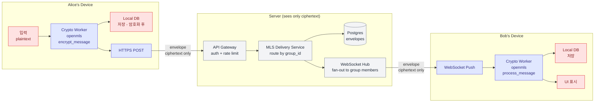

**범례:**
- 빨강: plaintext 영역 (사용자 디바이스 안에서만)
- 보라: ciphertext 전송/처리 경로
- 회색: 서버 (절대 plaintext 안 봄)

### 11.2 미디어 파이프라인

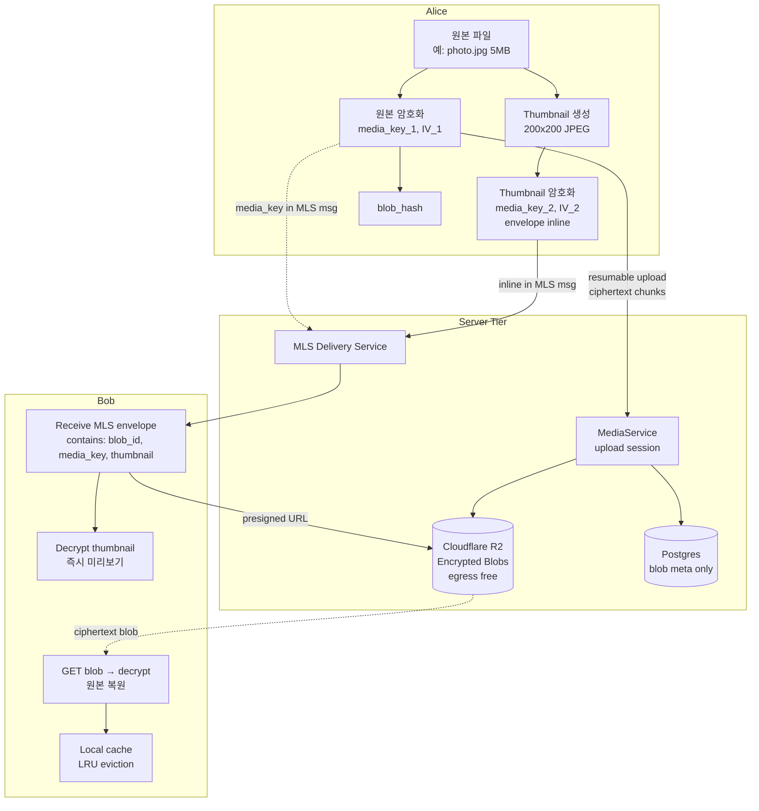

### 11.3 MLS 키 라이프사이클 파이프라인

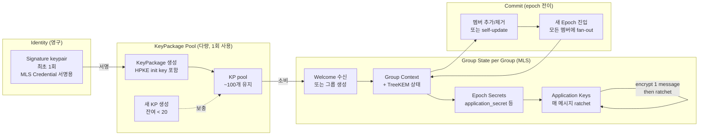

### 11.4 메시지 수명 (저장 → 전달 → 만료)

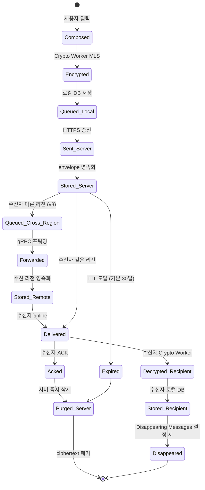

### 11.5 크로스 리전 메시지 파이프라인

```mermaid
flowchart LR
    subgraph "EU Region"
        EU_A[Alice<br/>plaintext → encrypt]
        EU_GW[EU Gateway<br/>auth + rate limit]
        EU_DS[EU Delivery Service<br/>persist + route]
    end

    subgraph "gRPC Mesh"
        GRPC[gRPC + mTLS<br/>ForwardEnvelope<br/>ciphertext only]
    end

    subgraph "KR Region"
        KR_DS[KR Delivery Service<br/>persist]
        KR_WS[KR WebSocket Hub<br/>fan-out]
        KR_B[Bob<br/>decrypt → plaintext]
    end

    EU_A -->|ciphertext| EU_GW
    EU_GW --> EU_DS
    EU_DS -->|ciphertext envelope| GRPC
    GRPC -->|ciphertext envelope| KR_DS
    KR_DS --> KR_WS
    KR_WS -->|ciphertext| KR_B

    classDef eu fill:#dbeafe,stroke:#3b82f6
    classDef kr fill:#fce7f3,stroke:#ec4899
    classDef mesh fill:#f3f4f6,stroke:#6b7280
    class EU_A,EU_GW,EU_DS eu
    class KR_DS,KR_WS,KR_B kr
    class GRPC mesh
```

---

## 12. 인프라 및 배포 파이프라인 (시각화)

### 12.1 환경 분리

| 환경 | 목적 | 호스팅 | 데이터 |
|---|---|---|---|
| local | 개발자 머신 | docker-compose | 실제 데이터 X |
| dev | 통합 테스트 | Hetzner k3s (작은 클러스터) | 합성 데이터 |
| staging | 사전 검증 | Hetzner k3s (prod 미러) | 합성 + 옵트인 베타 |
| prod-eu | EU 운영 | Hetzner k3s (Frankfurt, HA) | 실제 ciphertext |
| prod-kr | KR 운영 | Oracle Cloud / Vultr (Seoul, HA) | 실제 ciphertext |
| prod-jp | JP 운영 (향후) | Oracle Cloud (Tokyo) | 실제 ciphertext |

### 12.2 인프라 토폴로지 (멀티 리전)

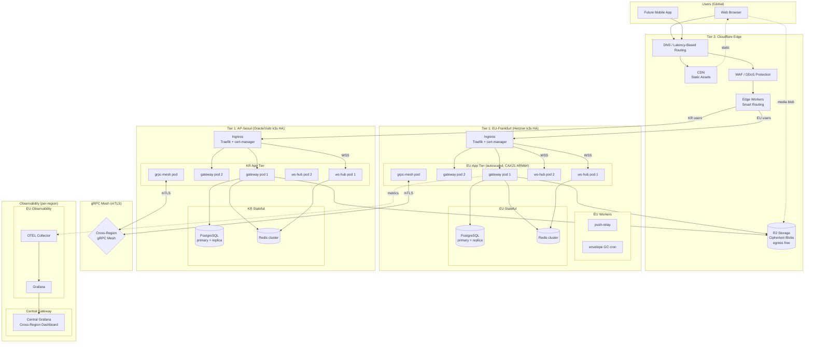

### 12.3 호스팅 결정 근거

**EU: Hetzner Cloud (Frankfurt)**

1. **비용 효율**: 동급 성능 AWS 대비 ~1/5. CAX21(4 vCPU ARM64, 8GB RAM) 약 EUR7.99/월.
2. **개인정보 거주성**: EU 데이터센터 → GDPR 친화적.
3. **자체 호스팅 친화성**: K8s manifest와 IaC를 그대로 다른 호스터로 이식 가능.

**AP: Oracle Cloud / Vultr (Seoul, Tokyo)**

1. **리전 내 레이턴시**: Seoul/Tokyo 리전으로 한국/일본 사용자 p99 <50ms 달성 목표.
2. **Oracle Cloud**: Always Free ARM 인스턴스 (Ampere A1, 4 OCPU, 24GB RAM) 가용.
3. **Vultr**: Seoul 리전 제공, 단순한 가격 구조, k3s 호환.
4. **결정 시점**: Phase 6 (Global Infrastructure) 시작 시 벤치마크 후 최종 선택.

**Cloudflare (R2 + Edge Workers)**

1. **R2 egress 무료**: 미디어 다운로드 비용 폭주 위험 차단.
2. **Edge Workers**: 글로벌 200+ PoP에서 스마트 라우팅. WebSocket 프록시.
3. **이식성**: R2 → MinIO/Garage 마이그레이션 무중단 가능.

### 12.4 인프라 코드화

| 도구 | 용도 |
|---|---|
| **Terraform / OpenTofu** | Hetzner/Oracle 리소스, Cloudflare DNS/R2/Workers |
| **Helm + Helmfile** | K8s 애플리케이션 배포 (리전별 values 오버라이드) |
| **Argo CD** | GitOps 동기화 (멀티 클러스터 지원) |
| **cert-manager** | TLS 인증서 자동 발급 (Let's Encrypt) |
| **External Secrets Operator** | 시크릿을 Vault/Hetzner Secrets로부터 K8s로 |

### 12.5 빌드 + 배포 파이프라인 시각화

```mermaid
flowchart TB
    DEV[Developer<br/>local commit]
    PR[Pull Request]

    subgraph "CI Pipeline (GitHub Actions)"
        LINT[cargo fmt<br/>cargo clippy<br/>biome check]
        TEST_U[Unit Tests<br/>cargo nextest + vitest]
        TEST_I[Integration Tests<br/>testcontainers + Postgres]
        AUDIT[cargo audit<br/>cargo deny<br/>SBOM 생성<br/>pnpm audit]
        WASM_BUILD[WASM Crypto Core<br/>빌드 + 결정론적 해시]
        FE_BUILD[Frontend Build<br/>Vite + reproducible]
        BE_BUILD[Server Build<br/>cargo build --release]
        IMG[Container Image<br/>distroless + cosign 서명]
        E2E[E2E Tests<br/>Playwright + 임시 k3s]
    end

    subgraph "Artifact Registry"
        REG[OCI Registry<br/>signed images]
        ATT[SLSA Provenance<br/>Level 3 목표]
    end

    subgraph "CD Pipeline (Argo CD, Multi-Cluster)"
        SYNC_DEV[Auto Sync to dev]
        SMOKE[Smoke Tests]
        SYNC_STG[Manual Sync to staging]
        CANARY[Canary 5% (EU)]
        ROLL_EU[EU Progressive Rollout 25→50→100%]
        ROLL_KR[KR Progressive Rollout 25→50→100%]
        SYNC_PROD[Sync to prod-eu + prod-kr<br/>+ approval]
    end

    subgraph "Verification"
        MON[Monitoring<br/>error rate, p99 latency<br/>per-region]
        ROLLBACK{Anomaly?}
    end

    DEV --> PR
    PR --> LINT
    LINT --> TEST_U
    TEST_U --> TEST_I
    TEST_I --> AUDIT
    AUDIT --> WASM_BUILD
    WASM_BUILD --> FE_BUILD
    WASM_BUILD --> BE_BUILD
    FE_BUILD --> IMG
    BE_BUILD --> IMG
    IMG --> E2E
    E2E --> REG
    REG --> ATT

    REG --> SYNC_DEV
    SYNC_DEV --> SMOKE
    SMOKE --> SYNC_STG
    SYNC_STG --> CANARY
    CANARY --> ROLL_EU
    CANARY --> ROLL_KR
    ROLL_EU --> SYNC_PROD
    ROLL_KR --> SYNC_PROD
    SYNC_PROD --> MON
    MON --> ROLLBACK
    ROLLBACK -->|yes| RB[Auto Rollback<br/>per-region]
    ROLLBACK -->|no| DONE[Release Complete]
```

### 12.6 Reproducible Build + SLSA

E2EE 메신저에서 가장 중요한 부분 — 사용자가 받는 바이너리가 공개된 소스코드와 진짜 일치하는지 검증 가능해야 합니다.

**SLSA 레벨 매핑:**

| Level | 요구사항 | Powehi 적용 |
|---|---|---|
| L1 | 빌드 프로세스 문서화 + provenance 생성 | GitHub Actions workflow 공개, SLSA generator 사용 |
| L2 | 호스팅된 빌드 서비스 사용 | GitHub Actions (L2 충족) |
| L3 | 신뢰 빌드 플랫폼 + provenance 위변조 방지 | Sigstore Cosign 서명 + Rekor transparency log |
| L4 | hermetic + reproducible | 장기 목표 (toolchain 고정, SOURCE_DATE_EPOCH) |

**구체적 전략:**

1. **고정된 toolchain**: `rust-toolchain.toml`, Node 버전 고정 (`pnpm-version`)
2. **잠긴 의존성**: `Cargo.lock`, `pnpm-lock.yaml` 커밋
3. **결정론적 빌드**:
   - `SOURCE_DATE_EPOCH` 환경변수로 타임스탬프 고정
   - 빌드 환경 컨테이너화 (정확한 base image 해시)
4. **서명**: Cosign으로 컨테이너 이미지 서명, Sigstore Rekor에 transparency log
5. **검증 가이드**: 사용자가 직접 빌드해서 해시 비교할 수 있는 단계별 문서 제공

### 12.7 Disaster Recovery (단일 리전)

| 시나리오 | 복구 전략 |
|---|---|
| Postgres primary 장애 | Managed Postgres 자동 failover (리전 내) |
| Redis 클러스터 장애 | 메시지 큐 데이터는 휘발 가능. 클라이언트 재연결 후 폴링으로 복구 |
| R2 리전 장애 | Cloudflare 자동 분산. 임시 장애 시 클라이언트 재시도 |
| 단일 k3s 클러스터 장애 | IaC로 재구축. 크로스 리전 페일오버로 서비스 연속성 보장 (§4A.7) |
| KeyPackage 서버 데이터 손실 | 클라이언트 보유 signature key로 재업로드 가능 |

### 12.8 글로벌 WebSocket 전략

**리전별 독립 ws-hub:**
- 각 리전은 자체 ws-hub pod를 운영. WebSocket 연결은 리전 로컬.
- Redis pub/sub는 리전 로컬만 사용. 크로스 리전 Redis 연결 없음.
- 크로스 리전 메시지 전달은 gRPC `ForwardEnvelope`로 처리.

**연결 흐름:**

```
1. 클라이언트 → Cloudflare Edge (가장 가까운 PoP)
2. Edge Worker → 최적 리전 ws-hub로 WSS 프록시
3. ws-hub는 리전 로컬 Redis에서 해당 사용자의 이벤트 구독
4. 크로스 리전 메시지 수신 시: gRPC → 리전 DS → Redis pub → ws-hub → 클라이언트
```

**스케일링:**
- ws-hub pod는 stateless (연결 상태만 인메모리)
- Redis에 `device_id → ws_hub_pod` 매핑 유지
- pod 재시작 시 클라이언트 자동 재연결 → 새 pod에 연결

### 12.9 멀티 리전 DR

**시나리오 1: 단일 리전 장애**

```
1. gRPC HealthCheck 실패 감지 (30초 간격, 3회 연속)
2. 장애 리전 status → 'degraded'
3. Cloudflare DNS 가중치 → 0 (트래픽 유입 차단)
4. 장애 리전 사용자의 크로스 리전 메시지 → 큐잉
5. 복구 시: 큐 flush + DNS 가중치 점진 복원
```

**시나리오 2: 전체 장애**

```
1. 모든 Tier 1 리전 응답 불가
2. Cloudflare Edge에서 503 + "서비스 점검 중" 페이지
3. IaC로 신규 리전 프로비저닝 (Postgres WAL 백업에서 복구)
4. RTO: <30분, RPO: <5분
```

**시나리오 3: gRPC 메시 장애 (리전 간 연결만 끊김)**

```
1. 각 리전은 독립적으로 정상 운영 (리전 내 메시지 정상)
2. 크로스 리전 envelope은 로컬 큐에 적재 (Postgres outbox 패턴)
3. 연결 복구 후 큐 일괄 포워딩 (순서 보장)
4. MLS commit은 그룹 home_region에서만 수락 → 타 리전 commit 큐잉
```

---

## 12A. 글로벌 규정 준수 매트릭스

| 규정 | 관할 | 핵심 요구사항 | Powehi 대응 |
|---|---|---|---|
| **GDPR** | EU/EEA | 개인 데이터 EU 내 처리, 삭제권, 동의 기반 | EU 사용자 데이터는 EU-Frankfurt에만 저장. 계정 삭제 시 전체 데이터 삭제. E2EE로 개인 데이터 처리 최소화. |
| **PIPA** | 한국 | 개인정보 국외 이전 시 정보주체 동의, 안전성 확보 | KR 사용자 데이터는 AP-Seoul에만 저장. 크로스 리전은 ciphertext(비개인정보)만 전달. |
| **APPI** | 일본 | 개인정보 보호, 제3자 제공 제한, 국외 이전 규정 | JP 사용자 데이터는 AP-Tokyo에 저장. 적정성 인정 없는 국가로의 이전 시 동의 필요. |
| **PDPA** | 싱가포르/태국 | 목적 제한, 동의 기반, 보호 수준 확보 | 해당 리전 확장 시 별도 평가. E2EE 특성상 데이터 처리 최소. |
| **CCPA/CPRA** | 미국 캘리포니아 | 삭제권, 판매 거부권, 데이터 접근권 | US 리전 확장 시 적용. 현재 미국 사용자는 EU 리전 사용. |
| **PIPL** | 중국 | 국내 저장 의무, 국외 이전 안전성 평가 | 중국 리전 계획 없음. 중국 내 서비스 불가 명시. |
| **LGPD** | 브라질 | GDPR 유사, 적법한 처리 기반 | 남미 리전 확장 시 별도 평가. |

**공통 원칙:**
- **Data Minimization**: E2EE로 서버가 처리하는 개인 데이터 자체가 최소 (handle_hash, OPAQUE envelope만)
- **Right to Erasure**: 계정 삭제 시 home_region의 모든 사용자 데이터 영구 삭제. 타 리전 복제본(KeyPackage)도 동기 삭제.
- **Cross-Border Transfer**: ciphertext만 전달되므로 개인정보의 국외 이전에 해당하지 않는다는 입장. 단, 관할별 법적 해석은 전문 법률 자문 필요.

---

## 13. Zero-Knowledge 관측 가능성

### 13.1 원칙: "로그조차 콘텐츠를 알 수 없다"

전통적 관측 시스템은 디버깅을 위해 페이로드를 로그에 남깁니다. Powehi에서는 **금지**됩니다.

### 13.2 무엇을 로그하는가

허용:
- 요청 ID, HTTP 메서드, 경로
- 응답 코드, 지연시간, 사이즈 (raw size 그대로 X, 버킷화)
- 인증 결과 (성공/실패)
- 시스템 메트릭 (CPU, 메모리, 큐 깊이)
- 에러 카테고리 (`AuthFailed`, `RateLimited`, `InvalidEnvelope`, `MlsProcessingFailed`)
- 리전 라우팅 결정 (source_region, target_region — 내용 아닌 방향만)

금지:
- envelope 페이로드 또는 그 일부
- 사용자 식별자를 평문으로 (해시 또는 internal ID로 대체)
- 미디어 blob 내용 또는 파일명 추측 가능 정보
- MLS 그룹 멤버십 관계의 평문 매핑

### 13.3 관측 스택 (글로벌 계층화)

```
[리전 로컬 레이어]
[App: Rust + tracing crate]
       │
       ▼ OTLP over HTTP
[OpenTelemetry Collector (리전별)]
       │
       ├──► [Prometheus (리전)]  ← 리전 Grafana
       ├──► [Loki (리전)]        ← 구조화 로그 (리전 로컬 보관)
       └──► [Tempo (리전)]       ← 분산 트레이싱

[중앙 집계 레이어]
[OTEL Gateway (Central)]
       │
       ├──► [Central Prometheus]  ← 크로스 리전 대시보드
       ├──► [Central Grafana]     ← 글로벌 뷰
       └──► [Alert Manager]      ← 글로벌 알림

[데이터 흐름]
리전 OTEL Collector → (집계된 메트릭만, 로그 원본 X) → Central Gateway → Grafana
```

**원칙:**
- 로그 원본은 리전 로컬에만 보관 (데이터 거주성)
- 중앙으로 전송되는 것은 집계된 메트릭과 trace ID만
- 크로스 리전 디버깅은 trace ID로 해당 리전 Grafana에서 직접 조회

### 13.4 합성 모니터링 (Synthetic Monitoring)

real-user 메시지는 콘텐츠 검증 불가. 별도의 시스템 테스트 계정을 운영하여 end-to-end 흐름을 합성 메시지로 검증:

**리전 내 테스트:**
- 5분마다 test-alice → test-bob 메시지 송수신 (각 리전별)
- 미디어 업로드/다운로드 round-trip
- MLS 그룹 생성 + welcome latency

**크로스 리전 테스트 (v3 추가):**
- 10분마다 EU test-alice → KR test-bob 크로스 리전 메시지 round-trip
- gRPC 메시 레이턴시 측정 (EU↔KR, EU↔JP)
- 크로스 리전 KeyPackage 소비 round-trip
- 리전 페일오버 시뮬레이션 (월 1회, 비운영 시간)

이 합성 메시지의 plaintext도 서버는 모릅니다. 측정은 wall-clock과 ACK 패턴으로만.

### 13.5 Cross-Region Trace Correlation

**멀티 리전 환경에서의 분산 트레이싱:**

- 모든 요청에 `trace_id` + `span_id` 부여 (OpenTelemetry W3C Trace Context)
- gRPC 메시를 통한 크로스 리전 호출 시 trace context 전파
- 크로스 리전 트레이스 조회: Central Grafana에서 trace_id 검색 → 각 리전 Tempo로 federated query

```
[EU Region]                        [KR Region]
Alice → EU Gateway → EU DS    →   KR DS → KR WS → Bob
  trace_id: abc123                   trace_id: abc123
  span: eu-gw (3ms)                  span: kr-ds (2ms)
  span: eu-ds (5ms)                  span: kr-ws (1ms)
  span: grpc-forward (45ms)
```

- **SLO 측정**: 크로스 리전 메시지 전달 p99 <200ms (gRPC 포워딩 포함)
- **알림**: 크로스 리전 p99 >500ms 시 PagerDuty alert

---

## 14. 수익 모델 및 모바일 전략

### 14.1 수익 모델: 3-Tier

**Tier 0: 무료 자체 호스팅**
- 100% MIT/Apache + 자체 코드는 Apache 2.0 듀얼 라이선스
- 자체 인프라에 운영. 비용은 사용자 부담.
- 코어 기능 100% 제공

**Tier 1: Powehi.app 호스팅 (옵션)**
- 일반 사용자가 가입할 수 있는 공식 인스턴스
- 무료 사용자: 미디어 저장 1GB, KeyPackage 풀 100개
- 유료 (월 ~$3): 미디어 저장 50GB, 우선 지원, 멀티 디바이스 동기화
- **중요**: 유료 사용자에 대해서도 서버 zero-knowledge 보장은 동일. "당신의 메시지가 더 안전해진다"는 거짓말 안 함. 단지 저장 공간이 늘어남.

**Tier 2: 엔터프라이즈 자체 호스팅 컨설팅**
- 기업/공공기관 대상 setup + 운영 지원
- SLA, 감사 보고서 제공
- LDAP/SAML 통합, 감사 로그 (콘텐츠 비포함)
- **멀티 리전 사설 배포**: 기업 전용 리전 구성, 데이터 거주성 맞춤 설정 (v3 추가)
- 이게 실질적인 주 수익원

**의도적으로 제외:**
- 광고 — 메타데이터 수집의 유혹이 큼, 신뢰 훼손
- 사용자 데이터 판매 — zero-knowledge 원칙 위배
- 트래픽 기반 과금 — 사용을 억제

### 14.2 모바일 전략

#### Phase 1-4 (웹 MVP): PWA 우선

- Service Worker + Web Push (RFC 8291 E2EE)
- iOS 16.4+ PWA 푸시 알림 지원, Safari 18.4+ Declarative Web Push
- "홈 화면 추가"로 native에 가까운 경험
- 별도 모바일 코드베이스 불필요

#### Phase 5+: 네이티브 평가 (필요 시)

| 옵션 | 코드 공유 | 권고도 | 비고 |
|---|---|---|---|
| **Tauri Mobile** | Rust 코어 + 웹 UI 그대로 | 1차 후보 | 2026년 기준 stable 직전, Phase 5 시점 재평가 |
| **React Native** | 비즈니스 로직만, UI는 별도 | fallback | `react-native-opaque` 존재, 성숙 |
| **Flutter** | 거의 100% 재작성 | 비권장 | 보안 critical 환경에서 검증 부족 |
| **각자 네이티브** | 0% | 비권장 | 메이저 메신저 길, 인력 부담 큼 |

**전략적 이점**: Rust crypto core를 모든 플랫폼에서 동일하게 사용 → 프로토콜 분기 제거. Tauri Mobile이 이를 가장 자연스럽게 지원.

---

## 15. 위험 요소 및 로드맵

### 15.1 알려진 기술적 위험

| 위험 | 영향 | 완화 방안 |
|---|---|---|
| **WASM 성능 병목** | 모바일/저사양에서 MLS 처리 지연 | Web Worker로 격리, KeyPackage 사전 생성, lazy load |
| **브라우저 보안 모델 한계** | XSS 한 번에 모든 게 무너짐 | CSP strict-dynamic, Trusted Types, dependency 최소화 |
| **키 백업 vs 보안** | 디바이스 분실 시 모든 메시지 손실 | identity 키만 BIP-39로 복구. 메시지 백업은 옵트인 별도 매커니즘 |
| **푸시 알림 메타데이터** | 푸시 제공자가 송수신 패턴 관찰 | RFC 8291 E2EE + 페이로드 최소화 (자극만) |
| **OpenMLS PQ 미성숙** | PQ ciphersuite 안정성 | Phase B로 점진 도입, MVP는 클래식 + 와이어 자리 예약 |
| **MLS deniability 부족** | 송신자 부인 불가 | 알려진 trade-off, 문서화 |
| **R2 vendor lock-in** | Cloudflare 의존 | S3 API 호환이라 Garage/MinIO로 이식 가능 |
| **트래픽 분석** | sealed sender 한계 | Tor/VPN 안내, padme padding |
| **크로스 리전 레이턴시** | gRPC 포워딩 추가 지연 (EU↔KR ~250ms) | Tier 2 릴레이로 hop 최소화, 리전 내 메시지는 영향 없음 (v3) |
| **데이터 거주성 규정 변경** | 각국 규정 변경 시 아키텍처 수정 필요 | 헥사고날 어댑터 패턴으로 리전 추가/변경 용이, 법률 자문 정기 검토 (v3) |
| **리전 간 일관성 버그** | KeyPackage 이중 소비, epoch 불일치 | home_region 직렬화 포인트, 통합 테스트에 크로스 리전 시나리오 포함 (v3) |

### 15.2 법적/규제 고려사항

- 일부 국가에서 E2EE 메신저 규제 (영국 Online Safety Act, EU CSAR 안건 등)
- 한국 통신비밀보호법 — 일반적인 메신저 운영 자체에는 문제 없음
- Apple/Google 앱스토어 정책 — Phase 5 모바일 출시 시 검토
- 암호 수출 통제 (Wassenaar Arrangement) — 표준 라이브러리 사용이므로 ENC/TSU exception 해당

**글로벌 규정 준수 매트릭스 (v3):**

| 규정 | 관할 | E2EE 메신저 영향 | Powehi 대응 |
|---|---|---|---|
| GDPR | EU/EEA | 개인 데이터 처리 최소화 의무, 삭제권 | E2EE로 최소 처리. EU 리전 데이터 저장. |
| PIPA | 한국 | 국외 이전 시 동의, 안전성 확보 | KR 리전 저장. ciphertext만 국외 전달. |
| APPI | 일본 | 제3자 제공 제한, 국외 이전 규정 | JP 리전 저장. 적정성 인정국 간 전달. |
| CCPA/CPRA | 미국 CA | 삭제권, 판매 거부 | US 리전 확장 시 적용. |
| Online Safety Act | 영국 | E2EE 스캔 의무 논란 | 기술적으로 불가 (서버 zero-knowledge). 법적 동향 모니터링. |
| CSAR (draft) | EU | 아동 보호 명목 스캔 의무 논란 | 동일. E2EE 원칙 유지, 법적 자문 확보. |

### 15.3 개발 로드맵

```mermaid
gantt
    title Powehi 개발 페이즈 (상대적 의존성)
    dateFormat X
    axisFormat %s
    section Foundation
    Workspace & 크레이트 골격 (Hexagonal)  :f1, 0, 3
    powehi-domain, ports 정의               :f2, after f1, 3
    OPAQUE 인증 통합                        :f3, after f1, 4
    Postgres 스키마 + 마이그레이션          :f4, after f1, 2

    section Crypto Core
    openmls Rust 통합                       :c1, after f2, 5
    WASM 빌드 + JS 바인딩 (Comlink)         :c2, after c1, 3
    크로스 환경 테스트                      :c3, after c2, 3

    section Server MVP
    KeyPackage Service                      :s1, after f4, 4
    MLS Delivery Service + WS hub           :s2, after f4, 5
    MediaService + R2 통합                  :s3, after s2, 4
    Web Push E2EE                           :s4, after s2, 3

    section Frontend MVP
    Crypto Worker 통합                      :w1, after c2, 3
    Dexie + 자체 암호화 layer               :w2, after w1, 3
    UI: 로그인/연락처/대화                  :w3, after w2, 5
    UI: 미디어 송수신                       :w4, after w3, 4
    Service Worker + 알림                   :w5, after w4, 3

    section Hardening
    위협 모델 검증 + Pentest                :h1, after w5, 5
    Reproducible Build 검증                 :h2, after w5, 3
    성능 최적화                             :h3, after w5, 4

    section Global Infrastructure
    gRPC 메시 + mTLS 구축                   :g1, after h1, 4
    AP-Seoul Tier 1 프로비저닝              :g2, after g1, 5
    AP-Tokyo Tier 2 프로비저닝              :g3, after g2, 4
    크로스 리전 통합 테스트                 :g4, after g2, 4
    글로벌 DR 검증                          :g5, after g4, 3
    Edge Worker 스마트 라우팅               :g6, after g1, 3

    section Post-MVP
    PQ 하이브리드 활성화                    :p1, after h1, 4
    Disappearing Messages                   :p2, after h1, 3
    모바일 앱 (Tauri vs RN 결정)            :p3, after g5, 8
    엔터프라이즈 기능 (LDAP/SAML)           :p4, after g5, 6
```

### 15.4 페이즈별 Definition of Done

#### Phase 1: Foundation
- [ ] Workspace 빌드 통과 (헥사고날 크레이트 구조)
- [ ] `cargo nextest` 통과율 100%
- [ ] OPAQUE 회원가입/로그인 통합 테스트 통과
- [ ] 헥사고날 의존성 방향 검증 (domain → ports → application → adapters)

#### Phase 2: Crypto Core
- [ ] openmls 래퍼 (`powehi-crypto-wasm`) 동작
- [ ] WASM 빌드 < 800KB (gzipped, MLS는 X3DH보다 큼)
- [ ] Alice→Bob 1:1 메시지 (2명 MLS 그룹) round-trip 통합 테스트 통과
- [ ] 외부 감사 가능한 reproducible build

#### Phase 3: Server MVP
- [ ] KeyPackage 업로드/소비 정상 동작
- [ ] MLS Welcome/Commit/Application 메시지 라우팅
- [ ] WebSocket 재연결 시 미수신 메시지 복구
- [ ] 미디어 청크 업로드 + 다운로드 통합 테스트 (R2)
- [ ] Web Push (RFC 8291) 푸시 전달

#### Phase 4: Frontend MVP
- [ ] 회원가입 → 메시지 송수신 풀 플로우 (Playwright E2E)
- [ ] Lighthouse 점수 PWA 80+
- [ ] Safety Numbers UI
- [ ] Region-Aware Client: 리전 감지 및 home_region 선택 UI

#### Phase 5: Hardening
- [ ] 외부 보안 감사 보고서 1건 이상
- [ ] CSP, Trusted Types, SRI 적용 100%
- [ ] 부하 테스트: 단일 클러스터 10k 동시 WS 연결
- [ ] SLSA Level 3 달성

#### Phase 6: Global Infrastructure
- [ ] gRPC 메시 + mTLS 리전 간 통신 동작
- [ ] AP-Seoul Tier 1 리전 독립 운영 확인
- [ ] 크로스 리전 메시지 round-trip p99 <200ms (EU↔KR)
- [ ] 단일 리전 장애 시 자동 페일오버 검증 (RTO <5분)
- [ ] KeyPackage 크로스 리전 복제 + 소비 무결성 검증
- [ ] 크로스 리전 합성 모니터링 동작
- [ ] 데이터 거주성 검증: home_region 외부로 PII 비전송 확인

---

## 16. 부록 + 변경 이력

### 16.1 부록 A: 명명 컨벤션

| 영역 | 컨벤션 |
|---|---|
| Rust 크레이트 | `powehi-*` (kebab-case) |
| Rust 모듈/함수 | `snake_case` |
| API 경로 | `/v1/<resource>` 복수형 |
| 프로토 메시지 | `PascalCase` |
| 환경 변수 | `POWEHI_*` (SCREAMING_SNAKE_CASE) |
| Git 브랜치 | `feat/`, `fix/`, `chore/` prefix |
| 디자인 토큰 | OKLCH 기반, `pwh-color-*` prefix |
| 리전 ID | `{continent}-{city}` (예: `eu-frankfurt`, `ap-seoul`, `ap-tokyo`) |

### 16.2 부록 B: MLS vs Signal Protocol 선택 근거

본 프로젝트는 초기 검토에서 Signal Protocol 채택을 가정했으나, 검증 과정에서 다음 사실 확인 후 MLS로 전환:

1. **라이선스 문제**: Signal 공식 `libsignal`은 **AGPLv3** — strong copyleft, 외부 프로젝트의 자유로운 사용 제약. 자체 호스팅 사용자에게도 의무 전파.
2. **목적 외 사용 제한**: Signal 공식 문서: *"이 라이브러리는 Signal의 애플리케이션과 서비스 내 사용을 위해 특별히 설계되었다. API는 사전 공지 없이 변경될 수 있다."*
3. **WASM 미지원**: 공식 WASM 빌드 부재, 사용자들 `getrandom` 백엔드 충돌 보고 다수 (2025년 기준).
4. **`docs.rs/libsignal-protocol`** (Michael Bryan)은 "minimal maintenance" 상태, 2019년 이후 사실상 방치.

**대안 분석:**

| 라이브러리 | 라이선스 | WASM | 평가 |
|---|---|---|---|
| `vodozemac` (Matrix.org) | Apache 2.0 | O | 2026.02 Soatok 보고 암호학적 이슈 |
| `openmls` | MIT/Apache 2.0 | O | RFC 9420 표준, 0.7.2 (2026.02) 활발 |
| 자체 조립 | MIT/Apache | O | 자체 암호 코드 = 위험 |

**MLS 채택 시 추가 이점:**
- 1:1과 그룹 코드 경로 통일
- 미래 PQ 하이브리드 ciphersuite 확장 명세
- IETF 표준 → 다른 클라이언트와의 상호운용 가능성

**수용한 trade-off:**
- MLS는 deniability 보장 안 함 (송신자 부인 불가)
- 메시지 크기 X3DH보다 약간 큼
- 라이브러리 생태계가 Signal Protocol보다 작음

### 16.3 부록 C: 참고 문헌 및 표준

- **RFC 9420**: The Messaging Layer Security (MLS) Protocol
- **RFC 9807**: The OPAQUE Asymmetric PAKE Protocol
- **RFC 8291**: Message Encryption for Web Push
- **RFC 8030**: Generic Event Delivery Using HTTP Push
- **NIST FIPS 203**: ML-KEM (Module-Lattice-Based KEM)
- OpenMLS docs: <https://openmls.tech/>
- opaque-ke (Meta): <https://github.com/facebook/opaque-ke>
- Signal PQXDH whitepaper (참고용)
- Signal SPQR whitepaper (참고용)

### 16.4 부록 D: 용어 사전

| 용어 | 설명 |
|---|---|
| E2EE | End-to-End Encryption. 송수신자 외 어떤 중간 노드도 평문을 모름 |
| MLS | Messaging Layer Security, RFC 9420 표준 그룹 메시징 프로토콜 |
| TreeKEM | MLS의 트리 구조 키 합의 매커니즘 |
| KeyPackage | MLS의 PreKey 대응. 사전 업로드되는 1회용 join 자격 |
| Welcome | MLS의 새 멤버 가입 시 그룹 상태 전달 메시지 |
| Commit | MLS의 그룹 상태 변경 메시지 (멤버 추가/제거/키 갱신) |
| Epoch | MLS 그룹의 상태 버전. commit으로 전이 |
| Forward Secrecy | 현재 키 유출이 과거 메시지를 노출하지 않음 |
| Post-Compromise Security | 키 유출 후 자동 회복 |
| Sealed Sender | 송신자 ID를 envelope 안에 함께 암호화 |
| aPAKE | Asymmetric Password-Authenticated Key Exchange |
| OPAQUE | 비밀번호를 서버에 전송하지 않는 aPAKE 표준 (RFC 9807) |
| KEM | Key Encapsulation Mechanism |
| ML-KEM | NIST 표준화된 PQ KEM (구 Kyber) |
| HPKE | Hybrid Public Key Encryption (RFC 9180) |
| AEAD | Authenticated Encryption with Associated Data |
| Reproducible Build | 동일 소스에서 항상 동일 바이너리가 나오는 빌드 |
| SLSA | Supply-chain Levels for Software Artifacts |
| Home Region | 사용자/그룹 데이터가 물리적으로 저장되는 리전 |
| gRPC Mesh | 리전 간 gRPC + mTLS 통신 네트워크 |
| Composition Root | 헥사고날 아키텍처의 DI 와이어링 진입점 |

### 16.5 부록 E: 최종 결정사항 요약표

| 항목 | 결정 |
|---|---|
| 프로젝트명 | Powehi |
| 백엔드 언어 | Rust |
| 백엔드 프레임워크 | axum + tokio |
| **백엔드 아키텍처** | **Hexagonal Architecture (Ports & Adapters)** |
| 암호화 라이브러리 | **OpenMLS (RFC 9420)** |
| 암호화 표준 | **MLS + PQ 하이브리드 (day-1 자리 예약)** |
| 인증 | OPAQUE (RFC 9807) via `facebook/opaque-ke` |
| 프론트엔드 | **React 19 + Vite 6 + TanStack** (Router/Form/Query) |
| 상태 관리 | Zustand |
| 로컬 DB | IndexedDB via Dexie + 자체 AES-GCM 암호화 |
| 그룹 메시징 | MLS (1:1도 동일 구조) |
| 연락처 발견 | **익명 핸들 + 초대 링크/QR** |
| 미디어 스토리지 | **Cloudflare R2 (1차)** + Garage (자체 호스팅) |
| 호스팅 (EU) | **Hetzner Cloud (Frankfurt)** |
| **호스팅 (AP)** | **Oracle Cloud / Vultr (Seoul, Tokyo)** |
| 푸시 알림 | RFC 8291 E2EE Web Push |
| 수익 모델 | **OSS + 옵션 호스팅 + 엔터프라이즈 컨설팅 (3-tier)** |
| 모바일 전략 | **PWA 우선, Phase 5+에 Tauri Mobile 평가** |
| **리전 간 통신** | **gRPC (tonic) + mTLS (rustls)** |
| **멀티 리전 토폴로지** | **3-Tier (Tier 1: R/W, Tier 2: Relay, Tier 3: Edge)** |
| **데이터 거주성** | **home_region 기반, PII 리전 외 비전송** |

### 16.6 부록 F: ADR (Architecture Decision Records)

#### ADR-001: Hexagonal Architecture 채택

- **상태**: 승인
- **맥락**: v2의 플랫 크레이트 구조(`powehi-core`, `powehi-storage` 등)는 도메인과 인프라가 결합. DB 변경 시 도메인 코드 수정 필요. 테스트 시 실제 DB 필요.
- **결정**: Hexagonal (Ports & Adapters) 패턴 채택. Domain, Ports, Application, Adapters를 별도 크레이트로 분리.
- **근거**: 컴파일 타임 의존성 강제, 어댑터 교체 용이 (테스트 시 인메모리 구현), 팀 병렬 작업 가능.
- **트레이드오프**: 크레이트 수 증가 (~20개), 초기 보일러플레이트 증가, 빌드 시간 소폭 증가.

#### ADR-002: 멀티 리전 아키텍처 채택

- **상태**: 승인
- **맥락**: v2의 단일 Frankfurt 리전은 아시아 사용자에게 ~270ms 레이턴시 발생. 타이핑 인디케이터, 프레즌스에 치명적. 한국/일본 데이터 거주성 규정 미충족.
- **결정**: 3-Tier 멀티 리전 토폴로지 채택. Tier 1 (EU, KR), Tier 2 (JP, US 향후), Tier 3 (Cloudflare Edge).
- **근거**: 리전 내 p99 <100ms 달성, 데이터 거주성 규정 준수, 리전 장애 격리.
- **트레이드오프**: 인프라 복잡도 증가, gRPC 메시 운영 부담, 크로스 리전 일관성 관리, 비용 증가.

#### ADR-003: 서버 검증 복구 문구 도전-응답 인증 경로 (§8.5)

- **상태**: 승인 (cycle 304)
- **맥락**: §8.5의 원래 설계는 클라이언트 단독의 identity 키 복원(BIP-39 → MLS 서명 키 재유도)만 다뤘고, 모든 디바이스를 분실한 사용자가 새 디바이스에서 서버에 새 `Device` 행을 어떻게 등록시키는지는 프로토콜화되어 있지 않았음. 이 세션 없는(pre-session) 디바이스 발급 흐름은 기존 "라이브 세션의 device_id 소유권 검증" 경로와 별개의, 새로운 인증 표면임.
- **결정**: 복구 문구로부터 MLS 서명 키와 **별개의 HKDF 도메인**(`powehi-recovery-auth-v1`)으로 독립된 Ed25519 키 쌍을 유도하고, 그 공개 키(`recovery_pubkey`)만 등록 시 서버에 영구 저장. 복원 로그인은 OPAQUE(비밀번호) 성공 이후에만 도달 가능하며, 서버가 발급한 1회용 로그인 nonce에 대한 도메인 분리된 서명(`verify_strict`)으로 복구 문구 소지를 증명해야 새 `Device` 행이 발급됨.
- **근거**: (1) 별도 HKDF 도메인이 서버가 영구 저장하는 `recovery_pubkey`를 서버가 알지 못해야 하는 MLS 서명 키로부터 암호학적으로 독립시킴(§3.3). (2) 비밀번호+문구 2요소 게이팅은 기존 어떤 인증 요소도 우회하지 않고 오히려 추가 요구사항을 얹음. (3) 모든 실패 모드(미등록/서명 오류/정원 초과)가 `Unauthorized`로 수렴하고 미등록 계정도 더미 키로 동일 연산을 수행해 오라클/타이밍 누출을 차단.
- **트레이드오프**: `users`에 새로운 영구 컬럼(공개 키) 추가 — §3.3에 명시 필요(완료). 복구 문구를 분실하면 이 경로도 사용 불가(설계상 fail-closed, 별도 백업 채널 없음). 디바이스 정원(`MAX_DEVICES_PER_USER`)에 도달한 계정은 이 경로로도 신규 디바이스를 발급받지 못함 — 가용성 트레이드오프로 accepted(향후 사이클에서 오래된 디바이스 자동 정리 등 고려 가능).

### 16.7 변경 이력

| 버전 | 변경 |
|---|---|
| v1 | 초기 플랜 작성. Signal Protocol 기반, 미정 항목 다수 |
| v2 | 검증 완료. Signal Protocol → MLS 전환, PQ day-1 격상, 미정 항목 6개 모두 결정, 호스팅 Hetzner+R2 확정 |
| **v3 (현재)** | **헥사고날 아키텍처 전환**, **멀티 리전 글로벌 서비스 설계**. 주요 변경: (1) §6 크레이트 구조를 Hexagonal Architecture로 전면 재구성, (2) §4A 멀티 리전 아키텍처 섹션 신설 (3-Tier 토폴로지, gRPC 메시, MLS commit 직렬화, 데이터 거주성), (3) §3 위협 모델에 T7 리전 관할 공격자 + §3.5 멀티 리전 위협 추가, (4) §12A 글로벌 규정 준수 매트릭스 신설, (5) §15 로드맵에 Phase 6: Global Infrastructure 추가, (6) 전 섹션에 걸쳐 멀티 리전 고려사항 반영 |

---

*이 문서는 살아있는 문서입니다. 결정사항이 바뀌면 해당 섹션을 업데이트하고, 변경 로그를 §16.7에 남겨주세요.*
